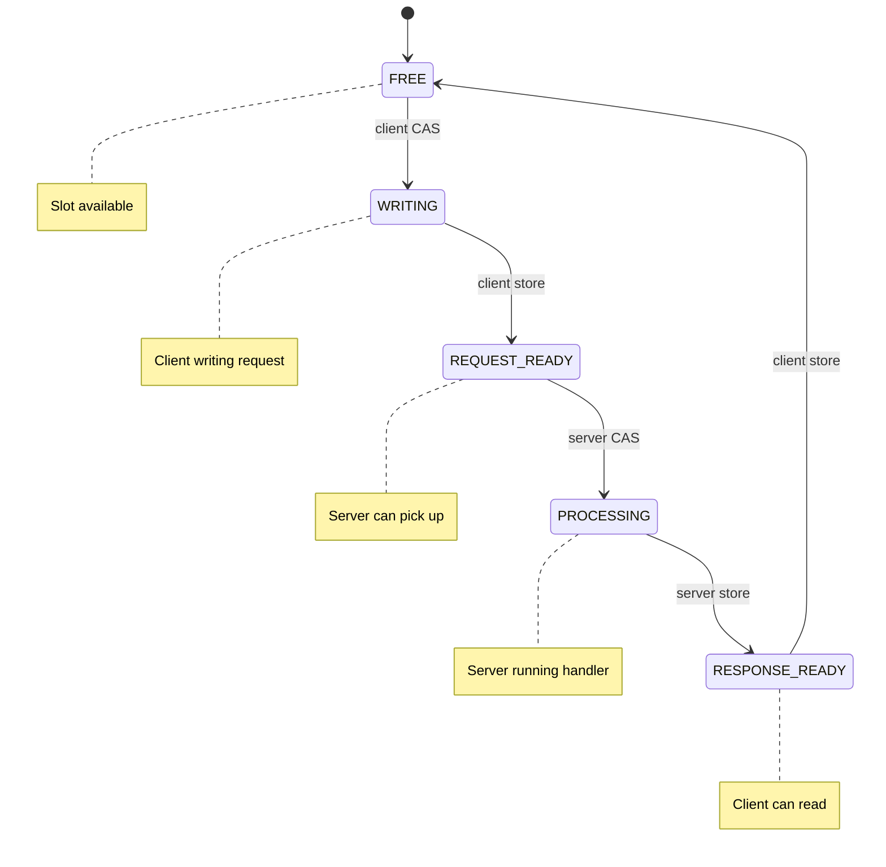

# Architecture: Where Does the Time Go?

This document explains why crossbar's three data paths have different latencies,
from the hardware up.

- Why is in-process (143 ns) **slower** than pub/sub (67 ns)?
- Why does SHM RPC (757 ns) add ~614 ns over in-process?
- What did we eliminate to get RPC from 54 us down to 757 ns?

---

## The three paths, side by side


---

## Why is in-process (143 ns) slower than pub/sub (67 ns)?

**They do completely different things.** This is not a fair comparison -- it's
like asking why a letter takes longer than a whistle.

### What pub/sub does (67 ns)

```
Publisher                                          Subscriber
    |                                                  |
    |  1. Write 8 bytes into SHM block      ~10 ns     |
    |  2. Store block_idx to ring slot      ~3 ns      |
    |  3. Store seqlock (close)             ~3 ns      |
    |  4. Bump write_seq                    ~3 ns      |
    |  5. Load waiters counter              ~2 ns      |
    |     (no futex -- waiters=0)                      |
    |                                                  |
    |                          6. Load write_seq  ~3 ns |
    |                          7. Load ring slot  ~3 ns |
    |                          8. CAS refcount    ~5 ns |
    |                          9. Deref pointer   ~1 ns |
    |                                                  |
    Total: ~33 ns of instructions + cache effects = 67 ns measured
```

Pub/sub moves **raw bytes**. No URI. No method. No headers. No routing. No
response. Just: here are bytes, take them.

### What in-process does (143 ns)

```
Client                                             Router
    |                                                  |
    |  1. Allocate URI string ("health")    ~15 ns     |
    |  2. Construct Request struct          ~10 ns     |
    |     (method, uri, headers, body)                 |
    |                                                  |
    |  3. router.dispatch(req):                        |
    |     a. Parse URI path segments        ~10 ns     |
    |     b. Iterate registered routes      ~10 ns     |
    |     c. Pattern match each segment     ~15 ns     |
    |     d. Extract path parameters        ~10 ns     |
    |     e. Call handler (async poll)      ~20 ns     |
    |     f. Handler returns value          ~5 ns      |
    |     g. IntoResponse conversion        ~10 ns     |
    |     h. Construct Response struct      ~15 ns     |
    |                                                  |
    Total: ~120 ns of instructions + overhead = 143 ns measured
```

In-process does **real work**: string allocation, URI parsing, route matching,
handler dispatch, response construction.

| | Pub/Sub | In-Process |
|---|---|---|
| What moves | Raw `&[u8]` | Structured `Request` / `Response` |
| Routing | None | URI pattern matching |
| Serialization | None | Request/Response construction |
| Handler | None -- subscriber reads bytes | Full async handler dispatch |
| Allocations | 0 | 2+ (URI string, response body) |

**Pub/sub is faster because it does less.** Not because it's a better transport.

---

## SHM RPC: 757 ns breakdown

The current SHM RPC path uses inline spinning, dedicated OS threads, smart wake,
and try-poll dispatch. No `spawn_blocking`, no futex on the hot path. Here is
every nanosecond accounted for:

| Step | Cost |
|---|---|
| Block pool alloc (Treiber stack CAS) | ~50 ns |
| Slot acquisition (CAS + hint scan) | ~80 ns |
| Request serialization into block | ~100 ns |
| Smart wake (atomic store, no syscall) | ~5 ns |
| Server: hint scan + CAS + dispatch_fast | ~300 ns |
| Response serialization into block | ~80 ns |
| Client: spin detection + zero-copy read | ~100 ns |
| **Total** | **~757 ns** |

### Coordination slot state machine

RPC uses a state machine to coordinate client and server:



Each arrow is an atomic operation:
- **CAS** (Compare-And-Swap): ~50-100 ns. CPU must acquire exclusive cache line
  ownership across cores.
- **Store with Release ordering**: ~10-30 ns. Flushes store buffer.

### Client request flow

1. **Acquire slot** -- CAS from `FREE` to `WRITING`. Hint-based scanning skips
   to the last-known free slot index to avoid scanning all 64 slots.
2. **Alloc block** -- pop from Treiber stack (single CAS).
3. **Serialize request** -- write URI, headers, body into the pool block.
4. **Smart wake** -- atomic store `REQUEST_READY`. Check the server's waiters
   counter (~2 ns). If the server is already spinning, skip the `futex_wake`
   syscall (~170 ns saved).
5. **Inline spin** -- spin on the slot state for ~2048 iterations (~2 us).
   Fast handlers (e.g. `/health`) respond within this window. No channels,
   no oneshot, no `spawn_blocking`.
6. **Poller fallback** -- if the handler is slow (> ~2 us), the request is
   handed to a dedicated poller thread with adaptive backoff
   (spin -> yield -> poll-based park).

### Server dispatch flow

1. **Hint-based scan** -- server skips to its last-known active slot.
2. **CAS** `REQUEST_READY` to `PROCESSING`.
3. **dispatch_fast** -- poll the handler future with a no-op waker. If the
   handler resolves on first poll (the common case for sync-like handlers),
   no tokio runtime context is needed. Only truly async handlers fall back
   to `block_on`.
4. **Write response** -- alloc a pool block, serialize the response, store
   `RESPONSE_READY`.

### Zero-copy reads

The client reads the response body via `Body::Mmap` -- a direct pointer into the
mmap region. No `memcpy` from SHM to heap. The `ShmBodyGuard` holds a refcount
on the block and frees it on drop.

---

## What was eliminated (71x speedup from the naive path)

The original SHM RPC implementation measured **54 us** per `/health` round-trip.
The following optimizations brought it down to **757 ns**:

| Optimization | Savings |
|---|---|
| **Inline spin** -- client spins on slot state, catches fast handlers without channels | ~4 us |
| **Dedicated OS threads** -- server poll loop off tokio, no `spawn_blocking` | ~15-20 us |
| **Smart wake** -- skip `futex_wake` syscall when server is busy | ~170 ns |
| **Try-poll dispatch** -- noop waker poll, skip `block_on` for sync handlers | ~200 ns |
| **Hint-based scanning** -- client + server skip to last-known slot | ~300 ns |
| **Zero-alloc route matching** -- literal patterns skip HashMap/Vec | ~50 ns |
| **Counter heartbeat** -- check liveness every 1024 requests | ~20 ns |
| **`CLOCK_MONOTONIC_COARSE`** -- ~6 ns timestamps instead of ~25 ns | ~19 ns |

The three biggest wins were eliminating `spawn_blocking` (dedicated OS threads
instead), eliminating futex on the hot path (smart wake + inline spin), and
try-poll dispatch (avoids `block_on` for handlers that resolve immediately).

---

## The hardware perspective

Every operation above maps to something the CPU and kernel actually do:

| Operation | What the hardware does | Time |
|---|---|---|
| Atomic load | CPU reads from L1 cache (if cached) or fetches cache line from another core | 1-50 ns |
| Atomic store (Release) | CPU flushes store buffer, ensures visibility to other cores | 5-30 ns |
| Atomic CAS | CPU acquires exclusive cache line ownership (MESI protocol), retries on contention | 20-100 ns |
| Memory allocation | `malloc`: search free list, split block, return pointer | 50-200 ns |
| String allocation | `malloc` + memcpy content | 50-200 ns |
| `memcpy` (64B) | Single cache line transfer | 5-10 ns |
| `memcpy` (64 KB) | ~1000 cache line transfers, may trigger TLB misses | ~1 us |
| Syscall (ring 0 transition) | Save registers, switch to kernel stack, restore on return | ~100 ns |
| `futex_wake` | Syscall + kernel hash table lookup + wake thread | ~170 ns |
| `futex_wait` wakeup | Kernel scheduler picks thread + context switch | 500 ns - 2 us |
| Cross-core cache transfer | Cache line moves between L2/L3 caches (MESI invalidation) | 20-80 ns |

---

## Summary table

| Layer | Pub/Sub (67 ns) | In-Process (143 ns) | SHM RPC (757 ns) |
|---|---|---|---|
| Request construction | -- | 20 ns | 20 ns |
| Request serialization | -- | -- | 100 ns |
| URI routing | -- | 50 ns | 50 ns |
| Handler dispatch | -- | 80 ns | 80 ns |
| Response serialization | -- | -- | 80 ns |
| Data transfer | 30 ns (atomics) | -- (direct call) | 30 ns (atomics) |
| Coordination (CAS) | -- | -- | 130 ns |
| Smart wake | 2 ns | -- | 5 ns |
| Inline spin detection | -- | -- | 100 ns |
| **Total** | **67 ns** | **143 ns** | **~757 ns** |
