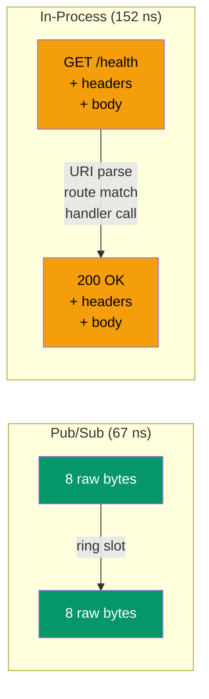
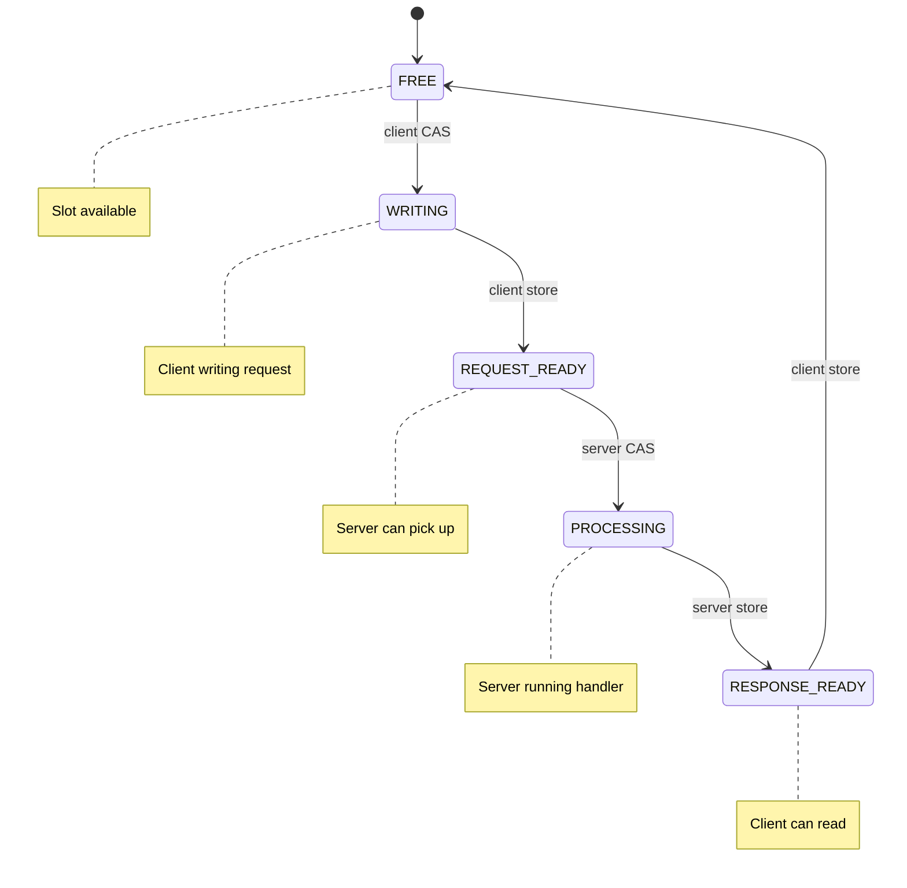
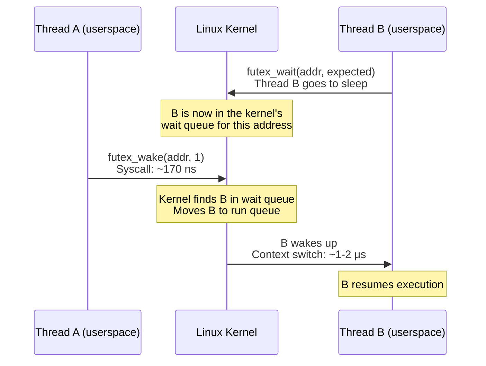
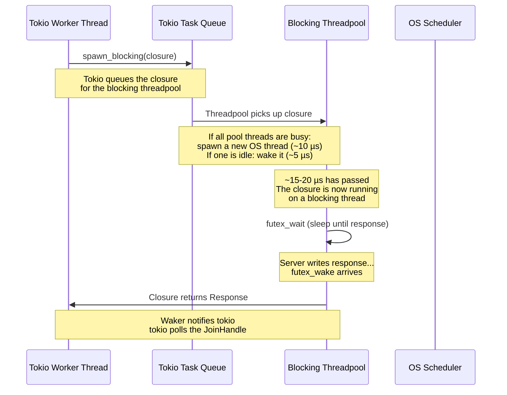
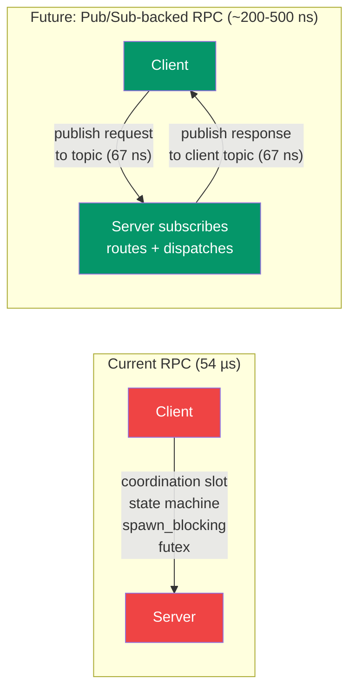

# Architecture Deep Dive: Where Does the Time Go?

This document explains why the three crossbar data paths have wildly different latencies, from the hardware up. Read this if you're wondering:

- Why is in-process (152 ns) **slower** than pub/sub (67 ns)?
- Why is RPC (54 µs) **350x slower** than pub/sub?
- What is `spawn_blocking` and why does it cost 15-20 µs?
- What is a futex and why does it cost 170 ns?

---

## The three paths, side by side


---

## Question 1: Why is in-process (152 ns) slower than pub/sub (67 ns)?

**They do completely different things.** This is not a fair comparison — it's like asking why a letter takes longer than a whistle.

### What pub/sub does (67 ns)

```
Publisher                                          Subscriber
    |                                                  |
    |  1. Write 8 bytes into SHM block      ~10 ns     |
    |  2. Store block_idx to ring slot      ~3 ns      |
    |  3. Store seqlock (close)             ~3 ns      |
    |  4. Bump write_seq                    ~3 ns      |
    |  5. Load waiters counter              ~2 ns      |
    |     (no futex — waiters=0)                       |
    |                                                  |
    |                          6. Load write_seq  ~3 ns |
    |                          7. Load ring slot  ~3 ns |
    |                          8. CAS refcount    ~5 ns |
    |                          9. Deref pointer   ~1 ns |
    |                                                  |
    Total: ~33 ns of instructions + cache effects = 67 ns measured
```

Pub/sub moves **raw bytes**. No URI. No method. No headers. No routing. No response. Just: here are bytes, take them.

### What in-process does (152 ns)

```
Client                                             Router
    |                                                  |
    |  1. Allocate URI string ("health")    ~15 ns     |
    |  2. Construct Request struct          ~10 ns     |
    |     (method, uri, headers, body)                 |
    |                                                  |
    |  3. router.dispatch(req):                        |
    |     a. Parse URI path segments        ~10 ns     |
    |     b. Iterate registered routes      ~10 ns     |
    |     c. Pattern match each segment     ~15 ns     |
    |     d. Extract path parameters        ~10 ns     |
    |     e. Call handler (async poll)      ~20 ns     |
    |     f. Handler returns value          ~5 ns      |
    |     g. IntoResponse conversion        ~10 ns     |
    |     h. Construct Response struct      ~15 ns     |
    |                                                  |
    Total: ~120 ns of instructions + overhead = 152 ns measured
```

In-process does **real work**: string allocation, URI parsing, route matching, handler dispatch, response construction. It's a full application-level request/response cycle.

### The comparison is misleading



| | Pub/Sub | In-Process |
|---|---|---|
| What moves | Raw `&[u8]` | Structured `Request` / `Response` |
| Routing | None | URI pattern matching |
| Serialization | None | Request/Response construction |
| Handler | None — subscriber reads bytes | Full async handler dispatch |
| Allocations | 0 | 2+ (URI string, response body) |

**Pub/sub is faster because it does less.** Not because it's a better transport.

---

## Question 2: Why is RPC 54 µs? (the full breakdown)

RPC does everything in-process does, **plus** serialization, **plus** cross-thread coordination, **plus** kernel syscalls. Here's every nanosecond accounted for:

```mermaid
gantt
    title SHM RPC Timeline — one /health round-trip (54 µs)
    dateFormat X
    axisFormat %s

    section Client (tokio thread)
    check_heartbeat                    :c1, 0, 100
    alloc_block (CAS)                  :c2, 100, 200
    try_acquire_slot (CAS)             :c3, 200, 400
    write_request_to_block             :c4, 400, 1400
    state=REQUEST_READY + futex_wake   :crit, c5, 1400, 1600
    spawn_blocking (tokio handoff)     :crit, c6, 1600, 18000

    section Server (poll thread)
    sleeping (idle)                    :s0, 0, 1000
    wakes from sleep                   :s1, 1600, 1700
    CAS REQUEST_READY → PROCESSING     :s2, 1700, 1800
    read_request_from_block (O1)       :s3, 1800, 1900
    block_on router.dispatch           :s4, 1900, 2100
    alloc_block + write_response       :s5, 2100, 3100
    state=RESPONSE_READY + futex_wake  :crit, s6, 3100, 3300

    section Client (spawn_blocking thread)
    futex_wait (sleeping)              :w1, 18000, 50000
    futex unblocks                     :crit, w2, 50000, 52000
    read_response_from_block           :w3, 52000, 52200
    state=FREE                         :w4, 52200, 52300
    return to tokio                    :w5, 52300, 54000
```



### Layer by layer: what happens and why

#### Layer 1: Application (your code)

```
client.get("/health")
```

This constructs a `Request { method: GET, uri: "/health", headers: {}, body: [] }`. Same as in-process. Cost: ~20 ns.

#### Layer 2: Serialization (~1-2 µs)

The request must be written into a shared memory block so the server process can read it. This means copying:

```
Block layout in /dev/shm:
┌──────────────────────────────────────────┐
│ URI bytes: "/health"           (7 bytes) │
│ Headers: count(u16) + key/value pairs    │
│ Body: (0 bytes for /health)              │
└──────────────────────────────────────────┘
```

Pub/sub skips this entirely — data is written directly into the block by the user (`as_mut_slice`). RPC must serialize a structured `Request` into a flat byte buffer.

The response goes through the same process in reverse.

**Cost: ~1 µs per direction = ~2 µs total.**

#### Layer 3: Coordination slot state machine (~500 ns)

RPC uses a state machine to coordinate client and server:



Each arrow is an atomic operation:
- **CAS** (Compare-And-Swap): ~50-100 ns. CPU must acquire exclusive cache line ownership across cores.
- **Store with Release ordering**: ~10-30 ns. Flushes store buffer.

5 transitions x ~100 ns average = **~500 ns**.

Pub/sub doesn't need this — there's no "request" or "response" to coordinate. Publisher writes, subscriber reads, refcount handles cleanup.

#### Layer 4: Futex syscalls (~2-4 µs)

A futex ("fast userspace mutex") is how one thread wakes another through the Linux kernel.



**What actually happens in the CPU:**

```
futex_wake (Thread A):
  1. User → Kernel transition (syscall)          ~50 ns
     - CPU saves registers to kernel stack
     - Switches to ring 0 (kernel mode)
  2. Kernel looks up futex hash table             ~20 ns
  3. Kernel moves Thread B to run queue           ~50 ns
  4. Kernel → User transition (sysret)            ~50 ns
                                          Total: ~170 ns

futex_wait wakeup (Thread B):
  1. Kernel scheduler picks Thread B              ~500 ns - 2 µs
     - Depends on CPU load, core migration
  2. Kernel → User transition (sysret)            ~50 ns
  3. Thread B resumes execution
                                          Total: ~1-2 µs
```

RPC does this **twice**: once for request (client wakes server), once for response (server wakes client). **Total: ~2-4 µs.**

Pub/sub with smart wake **skips this entirely** when using `try_recv()`. The publisher checks `waiters.load()` (~2 ns), sees 0, and never issues the syscall.

#### Layer 5: `spawn_blocking` (~15-20 µs) — THE BIGGEST COST

This is the single most expensive operation in the entire RPC path.

**Why it exists:** The client is async (runs on tokio). But waiting for the server's response is a *blocking* operation (futex_wait). You cannot block a tokio worker thread — it would freeze all other async tasks on that thread. So tokio moves the blocking wait to a separate threadpool.



**What happens inside `spawn_blocking`:**

```
1. Tokio locks its internal blocking queue            ~50 ns
2. Allocates a JoinHandle (heap allocation)           ~100 ns
3. Checks if a blocking thread is idle                ~50 ns
   a. If yes: wake it (condvar signal)                ~1-2 µs
   b. If no: spawn new OS thread                      ~10-50 µs
      - mmap for stack (8 MB default)
      - clone() syscall
      - scheduler adds thread
4. Blocking thread picks up the closure               ~1-2 µs
5. Closure starts executing                           ~100 ns

Total: 5-20 µs depending on thread availability

After the closure returns:
6. Waker stored by JoinHandle is invoked              ~100 ns
7. Tokio worker thread is notified                    ~500 ns
8. Worker thread polls the JoinHandle                 ~100 ns
9. Response is extracted                              ~100 ns

Total return path: ~1 µs
```

**Why this is so expensive:** it's fundamentally a cross-thread handoff. The closure must be boxed (heap allocation), sent to another thread (synchronization), and the result sent back (another synchronization). Each synchronization involves cache line transfers between CPU cores.

#### Layer 6: Server poll loop idle sleep (0-1 µs)

When the server has no work, it calls `std::thread::sleep(Duration::from_micros(1))`. This means a new request might wait up to 1 µs before the server even notices it.

```
Server poll loop:
  loop {
      for slot in 0..64 {           // scan all slots
          if slot.state == REQUEST_READY {
              // process it
          }
      }
      if no_work_found {
          sleep(1 µs);              // <-- client waits here
      }
  }
```

Pub/sub doesn't have this — the subscriber checks the ring directly with `try_recv()`.

---

## The full picture: all layers combined


---

## The hardware perspective

Every operation above maps to something the CPU and kernel actually do:

| Operation | What the hardware does | Time |
|---|---|---|
| Atomic load | CPU reads from L1 cache (if cached) or fetches cache line from another core | 1-50 ns |
| Atomic store (Release) | CPU flushes store buffer, ensures visibility to other cores | 5-30 ns |
| Atomic CAS | CPU acquires exclusive cache line ownership (MESI protocol), retries on contention | 20-100 ns |
| Memory allocation | `malloc`: search free list, split block, return pointer | 50-200 ns |
| String allocation | `malloc` + memcpy content | 50-200 ns |
| `memcpy` (64B) | Single cache line transfer | 5-10 ns |
| `memcpy` (64 KB) | ~1000 cache line transfers, may trigger TLB misses | ~1 µs |
| Syscall (ring 0 transition) | Save registers, switch to kernel stack, restore on return | ~100 ns |
| `futex_wake` | Syscall + kernel hash table lookup + wake thread | ~170 ns |
| `futex_wait` wakeup | Kernel scheduler picks thread + context switch | 500 ns - 2 µs |
| OS thread spawn | `clone()` syscall + stack mmap + scheduler bookkeeping | 10-50 µs |
| Cross-core cache transfer | Cache line moves between L2/L3 caches (MESI invalidation) | 20-80 ns |
| Thread context switch | Save/restore registers, flush TLB (if different process) | 1-5 µs |

---

## Why `spawn_blocking` exists (and why it's the bottleneck)

Tokio is an **async runtime**. It runs thousands of tasks on a small number of threads (typically 1 per CPU core). The contract is: **never block a tokio worker thread**.

```
Tokio worker thread (1 of 8):
┌─────────────────────────────────────────┐
│  task A: poll() → ready     (50 ns)     │
│  task B: poll() → pending   (20 ns)     │
│  task C: poll() → ready     (100 ns)    │
│  task D: poll() → ready     (30 ns)     │
│  ...hundreds more tasks...              │
│                                         │
│  If ANY task blocks for 54 µs:          │
│  ALL other tasks on this thread stall.  │
└─────────────────────────────────────────┘
```

The RPC client must wait for the server to respond. That wait is a `futex_wait` — a blocking syscall that puts the thread to sleep. If we did this on the tokio worker thread, every other task on that thread would freeze.

So `spawn_blocking` moves the wait to a separate threadpool thread. That thread can sleep without affecting anyone. But the handoff costs ~15-20 µs.

**This is the fundamental design tension:**
- Pub/sub doesn't use tokio at all — it's a synchronous API. No `spawn_blocking` needed.
- In-process doesn't wait for anything — the handler runs immediately. No `spawn_blocking` needed.
- RPC must wait for another process to respond — and waiting means blocking — and blocking means `spawn_blocking`.

---

## The path forward: pub/sub-backed RPC

The user's insight: if pub/sub can move data at 67 ns, why can't we build routing on top of it?



This would eliminate:
- `spawn_blocking` (no tokio involvement)
- Coordination slot state machine (use pub/sub ring instead)
- Futex syscalls (smart wake handles it)
- Server poll sleep (subscriber polls ring directly)

What remains:
- Request serialization (~1 µs for structured requests)
- Router dispatch (~152 ns)
- Response serialization (~1 µs)
- Two pub/sub transfers (67 ns x 2 = 134 ns)

**Estimated total: ~2-3 µs** — a 20x improvement over the current 54 µs.

---

## Summary table

| Layer | Pub/Sub (67 ns) | In-Process (152 ns) | SHM RPC (54 µs) |
|---|---|---|---|
| Request construction | -- | 20 ns | 20 ns |
| Request serialization | -- | -- | 1,000 ns |
| URI routing | -- | 50 ns | 50 ns |
| Handler dispatch | -- | 80 ns | 80 ns |
| Response construction | -- | -- | -- |
| Response serialization | -- | -- | 1,000 ns |
| Data transfer | 30 ns (atomics) | -- (direct call) | 30 ns (atomics) |
| Coordination (CAS x5) | -- | -- | 500 ns |
| Futex syscalls (x2) | -- | -- | 2,500 ns |
| Server poll wakeup | -- | -- | 500 ns |
| `spawn_blocking` | -- | -- | **17,000 ns** |
| Return to tokio | -- | -- | 1,000 ns |
| **Total** | **67 ns** | **152 ns** | **~54,000 ns** |
