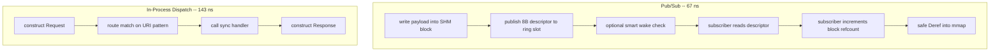

# Architecture: Two Fast Paths

This document explains the two remaining execution paths in crossbar after the
RPC refactor:

- **In-process dispatch** for endpoint-style routing within one process
- **Pub/sub** for zero-copy shared-memory streaming between processes

The crate deliberately keeps these paths separate. They solve different
problems and have different hot-path costs.

---

## Side by side

```mermaid
graph TB
    subgraph "Pub/Sub -- 67 ns"
        PS1["write payload into SHM block"]
        PS2["publish 8B descriptor to ring slot"]
        PS3["optional smart wake check"]
        PS4["subscriber reads descriptor"]
        PS5["subscriber increments block refcount"]
        PS6["safe Deref into mmap"]
        PS1 --> PS2 --> PS3 --> PS4 --> PS5 --> PS6
    end

    subgraph "In-Process Dispatch -- 143 ns"
        IP1["construct Request"]
        IP2["route match on URI pattern"]
        IP3["call sync handler"]
        IP4["construct Response"]
        IP1 --> IP2 --> IP3 --> IP4
    end
```

---

## Why pub/sub is faster

Pub/sub does one thing: move bytes by descriptor.

On the hot path it pays for:

1. writing data into an already-loaned block
2. publishing an 8-byte `(block_idx, len)` descriptor into the ring
3. a small amount of synchronization (`AtomicU64` seqlock + `AtomicU32` refcount)
4. exposing the payload through `SampleGuard`

That is why the transport cost stays O(1) with respect to transfer overhead.
Larger payloads still cost more to **write**, but not more to **publish**.

### Key invariants

- Blocks come from a shared pool backed by a Treiber stack.
- Each published block starts with `refcount = 1`.
- Subscribers increment the refcount before exposing a guard.
- Ring overwrite decrements the previous block's refcount.
- A block returns to the free list only when its refcount reaches zero.

This is what makes `SampleGuard` safe to hold even if the ring slot is
later overwritten.

---

## Why in-process dispatch is slower

In-process dispatch does more real work than pub/sub:

1. build a `Request`
2. parse and match the URI
3. populate path/query state
4. call the handler
5. build a `Response`

That is a useful cost, not accidental overhead. The router is doing actual
endpoint-style dispatch rather than raw streaming.

| Path | What it optimizes for |
|---|---|
| Pub/sub | raw data movement |
| In-process dispatch | endpoint ergonomics |

Comparing their latency directly is only partially meaningful because the two
paths provide different semantics.

---

## Shared-memory layout

Pub/sub uses one mmap region with three logical areas:

1. **Global header**: config, heartbeat, and pool head pointer
2. **Topic table + rings**: topic metadata and per-topic descriptor rings
3. **Block pool**: payload storage plus per-block refcounts

### Publish flow

1. Pop a block index from the free list
2. Write payload bytes into the block at `BLOCK_DATA_OFFSET`
3. Set the block refcount to 1
4. Write `(block_idx, len)` into the next ring slot
5. Advance the write sequence
6. Wake blocked subscribers only when needed

### Receive flow

1. Read the latest visible ring slot
2. Increment the referenced block's refcount
3. Re-check the slot sequence to detect overwrite races
4. Return `SampleGuard`
5. Decrement/free on guard drop

---

## Heartbeats and liveness

The publisher updates a heartbeat timestamp in the shared header at a fixed
interval. Subscribers check that timestamp when blocking in `recv()`.

- If the heartbeat is fresh, `recv()` continues polling or sleeping.
- If it goes stale, `recv()` returns `CrossbarError::ShmPublisherDead`.

This keeps failure detection in the transport without introducing a separate
control plane.

---

## Comparison to iceoryx2

The pub/sub path is the closest analogue to `iceoryx2`.

| Aspect | crossbar | iceoryx2 |
|---|---|---|
| Pool allocation | Treiber stack | lock-free pool |
| Publication | ring of descriptors | ring of descriptors |
| Read API | safe guard with `Deref<[u8]>` | typed zero-copy sample API |
| Higher-level API | URI/topic names + in-process router | typed service/topic configuration |

Crossbar's distinction is not a radically different SHM primitive. The
distinction is the API layer above it: URI-addressed subscriptions and a small
endpoint-style router for same-process dispatch.
