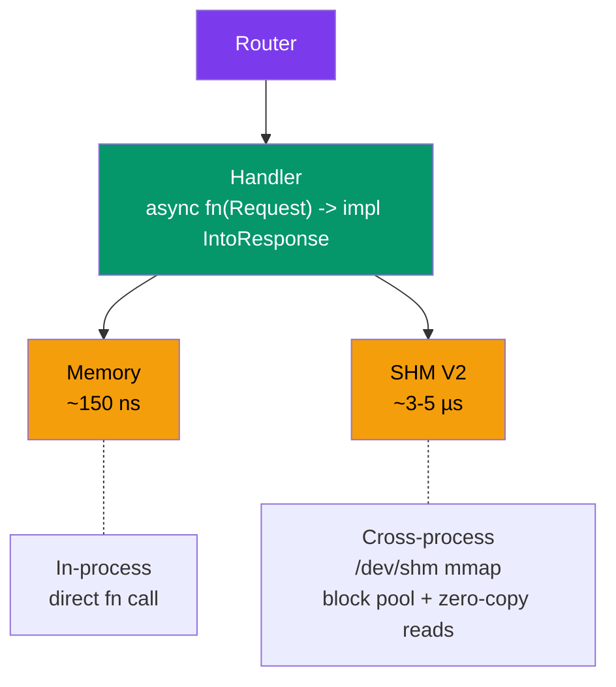

# crossbar

[](https://github.com/userFRM/crossbar/actions/workflows/ci.yml)
[](LICENSE-MIT)
[](https://www.rust-lang.org)

**Define handlers once. Serve over any transport.**

Crossbar is a transport-agnostic URI router for Rust. You write your request handlers once — then serve them over in-process memory or cross-process shared memory. Switch transports without changing a single line of handler code.

```rust
let router = Router::new()
    .route("/health", get(health))
    .route("/tick/:symbol", get(get_tick))
    .route("/echo", post(echo));

// Same router, same handlers — pick your transport.
MemoryClient::new(router.clone());                         // in-process,     ~150 ns
ShmServer::spawn("myapp", router.clone()).await?;          // cross-process,  ~3-5 µs
```

---

## What is crossbar?

Most web frameworks (axum, actix, warp) couple your handlers to HTTP. Crossbar doesn't. It gives you a lightweight router where the **transport is just a deployment decision** — not a code decision.

**In plain terms:** imagine you have a function that returns stock prices. With crossbar, that same function can serve requests from:

- Another function in the same program (150 nanoseconds)
- Another process on the same machine via shared memory (3-5 microseconds)

You never change the function. You only change how it's wired up.

> [!NOTE]
> Crossbar is **not** an HTTP framework. It uses a compact binary protocol
> instead of HTTP. If you need HTTP, use [axum](https://github.com/tokio-rs/axum). Crossbar
> targets workloads where HTTP overhead matters: trading systems, game servers, IPC sidecars,
> and real-time pipelines.

---

## Showcase: demo

Run the demo to see both transports in action with a latency comparison:

```sh
cargo run --example demo --features shm
```

The demo builds a single router and exercises it over both Memory and SHM transports, printing per-transport latency statistics (min, avg, p99, max).

---

## When to use crossbar (and when not to)

### Use crossbar when

- **You need IPC with URI routing** — crossbar gives you REST-like patterns (`/tick/:symbol`) without HTTP overhead
- **You're building a trading system** — sub-microsecond in-process dispatch, with cross-process SHM for co-located services
- **You have co-located services** — game servers, microservice sidecars, or ML pipelines on the same host
- **You want transport-agnostic testing** — swap SHM for `MemoryClient` and run integration tests without shared memory setup

### Don't use crossbar when

- **You need HTTP** — use [axum](https://github.com/tokio-rs/axum) or [actix-web](https://github.com/actix/actix-web)
- **You need browser compatibility** — crossbar's wire protocol is not HTTP
- **You need true zero-copy IPC** — see [How crossbar compares](#how-crossbar-compares) below
- **You want a mature ecosystem** — crossbar is new; axum has middleware, extractors, and a large community

> [!TIP]
> The crossbar roadmap includes an **HTTP bridge** that will let you serve crossbar routes
> over hyper/axum. This will give you the best of both worlds: crossbar for internal IPC,
> HTTP for external traffic, same handlers.

---

## How each transport works

Every transport follows the same pattern: the **client** sends a `Request`, the **router** dispatches it to a handler, and the **server** returns a `Response`. The difference is how the bytes travel between client and server.

### Memory — direct function call

```
Client                   Server
  │                        │
  ├── router.dispatch(req) ┤  (direct call, same thread)
  │                        │
  ◄── Response ────────────┘
```

The simplest transport. `MemoryClient` holds an `Arc<Router>` and calls `router.dispatch(req)` directly — the same way you'd call any async function. There is no serialization, no framing, no I/O. The request and response stay in the same memory space and the same thread.

**Cost:** one async function call (~150 ns).

**Use case:** in-process dispatch, unit testing, embedding crossbar as a function router.

### SHM — shared memory with block pool and zero-copy reads (V2)

```
Client process                      Server process
  │                                     │
  ├── alloc request block (CAS)         │
  ├── memcpy request into block         │
  ├── acquire slot, set REQUEST_READY   │
  │                                     ├── poll: sees REQUEST_READY
  │                                     ├── state = PROCESSING
  │                                     ├── read request (zero-copy via Bytes::from_owner)
  │                                     ├── router.dispatch(req)
  │                                     ├── alloc response block
  │                                     ├── memcpy response into block
  │                                     ├── state = RESPONSE_READY
  ├── poll: sees RESPONSE_READY ◄───────┤
  ├── read response (zero-copy via Bytes::from_owner)
  ├── state = FREE                      │
  │                                     │
```

Both processes `mmap` the same file at `/dev/shm/crossbar-{name}`. The V2 architecture separates **coordination slots** (64 bytes each, hold state machine) from **data blocks** (configurable size, hold request/response payloads). Blocks are managed by a lock-free Treiber stack allocator.

Key V2 improvements over V1:
- **Zero-copy reads:** Response bodies are returned as `Bytes::from_owner`, pointing directly into the mmap region. No memcpy on the read path.
- **Block pool:** Data blocks are allocated independently from coordination slots, allowing more efficient memory utilization.
- **Decoupled sizing:** Coordination slots are small and fixed; data block size is configurable independently.

Synchronization uses a spin-then-futex strategy: spin briefly, then fall back to `futex_wait` (Linux) or polling (macOS) to avoid burning CPU while idle.

**Cost:** one `memcpy` per write + zero-copy reads + atomic synchronization (~3-5 µs). No kernel syscalls on the data path.

**Use case:** ultra-low-latency cross-process IPC on the same host.

> [!IMPORTANT]
> Crossbar's SHM transport copies data into shared memory blocks on the write path but uses
> zero-copy `Bytes::from_owner` on the read path. This is different from **true zero-copy**
> solutions like [iceoryx2](https://github.com/eclipse-iceoryx/iceoryx2), which transfer only
> a pointer offset (~8 bytes) regardless of payload size. See
> [How crossbar compares](#how-crossbar-compares) for a detailed breakdown.

---

## How crossbar compares

### vs axum / actix-web

Crossbar and HTTP frameworks solve different problems. Crossbar provides URI routing without HTTP — no headers, no content negotiation, no middleware ecosystem. If your service talks to browsers or external clients, use axum. If your services talk to each other on the same host, crossbar removes HTTP overhead while keeping the same routing patterns.

### vs iceoryx2

[iceoryx2](https://github.com/eclipse-iceoryx/iceoryx2) is a true zero-copy shared memory middleware. The architectural difference is fundamental:

| | crossbar SHM (V2) | iceoryx2 |
|---|---|---|
| **What is transferred** | Write: memcpy into block. Read: zero-copy pointer | A pointer offset (~8 bytes) |
| **Write-side scaling** | O(n) — grows with payload size | O(1) — data "born" in SHM |
| **Read-side scaling** | O(1) — `Bytes::from_owner` | O(1) — pointer deref |
| **Pattern** | Request/response with URI routing | Publish/subscribe (and request/response) |
| **Memory model** | Block pool allocator, Treiber stack | Pool allocator, producer writes directly into shared memory |
| **Routing** | Built-in URI pattern matching | Service-oriented discovery |

**When to choose iceoryx2:** you need the absolute lowest latency regardless of payload size, you're streaming large data (sensor feeds, video frames, point clouds), or you're in an automotive/robotics context where iceoryx2's safety certifications matter.

**When to choose crossbar:** you want familiar REST-like URI routing (`/api/orders/:id`), you need both in-process and cross-process transports, your payloads are small (< 64 KB where the memcpy cost is negligible), or you want the simplicity of a single router that works identically across in-process and cross-process contexts.

> [!NOTE]
> Crossbar is not trying to compete with iceoryx2 on raw shared memory throughput. They
> occupy different niches. Crossbar's value is **transport polymorphism** — the same router
> and handlers serving over any transport, from a direct function call to cross-process SHM.

### vs raw Unix IPC (pipes, message queues, domain sockets)

Crossbar adds URI-based routing on top of shared memory. Without crossbar, you'd need to implement your own message framing, request dispatching, and serialization. Crossbar gives you `router.route("/tick/:symbol", get(handler))` semantics over any transport.

---

## Architecture



---

## Transport comparison

| Transport | Typical latency | Boundary | Data path | Platform |
|---|---|---|---|---|
| **Memory** | ~150 ns | Same thread | Direct `Arc<Router>` call | All |
| **SHM** | ~3-5 µs | Cross-process | `mmap` + block pool + atomics + futex | Unix (`shm` feature) |

> [!IMPORTANT]
> These latency numbers are from Criterion benchmarks (see [BENCHMARKS.md](BENCHMARKS.md)).
> They will vary on your hardware. Run `cargo bench --features shm` to see your own numbers.

---

## Getting started

### 1. Add the dependency

```toml
[dependencies]
crossbar = "0.1"
tokio = { version = "1", features = ["rt-multi-thread", "macros"] }
```

For shared memory transport (Unix only):

```toml
crossbar = { version = "0.1", features = ["shm"] }
```

### 2. Define your handlers

Handlers are async functions returning anything that implements `IntoResponse`:

```rust
use crossbar::prelude::*;

async fn health() -> &'static str { "ok" }

async fn greet(req: Request) -> String {
    let name = req.path_param("name").unwrap_or("world");
    format!("Hello, {name}!")
}

async fn create_order(req: Request) -> Result<Json<Order>, (u16, &'static str)> {
    let input: OrderInput = req.json_body()
        .map_err(|_| (400u16, "invalid JSON"))?;
    Ok(Json(process(input)))
}
```

### 3. Build the router

```rust
let router = Router::new()
    .route("/health", get(health))
    .route("/greet/:name", get(greet))
    .route("/order", post(create_order));
```

### 4. Serve over any transport

```rust
// In-process (testing, embedded)
let mem = MemoryClient::new(router.clone());
let resp = mem.get("/health").await;

// Shared memory (cross-process, same host)
ShmServer::bind("myapp", router).await?;
// In another process:
let client = ShmClient::connect("myapp").await?;
let resp = client.get("/health").await?;
```

> [!TIP]
> Use `MemoryClient` in your test suite. It has zero network overhead and doesn't need
> port allocation, so your tests run faster and never flake on CI due to port conflicts.

---

## Handler system

Crossbar supports async handlers, sync wrappers, a `#[handler]` proc macro, and a rich `IntoResponse` trait.

### Async handlers

```rust
async fn health() -> &'static str { "ok" }                // zero args
async fn echo(req: Request) -> String { req.body_str() }   // receives Request
```

### Sync handlers

```rust
use crossbar::prelude::*;

let router = Router::new()
    .route("/health", get(sync_handler(|| "ok")))
    .route("/echo", post(sync_handler_with_req(|req: Request| {
        format!("got {} bytes", req.body.len())
    })));
```

### `#[handler]` proc macro

Extract path params, query params, and JSON bodies automatically:

```rust
use crossbar_macros::handler;

#[handler]
async fn get_tick(
    #[path("symbol")] symbol: String,
    #[query("venue")] venue: Option<String>,
    #[body] filters: Filters,
) -> Json<TickData> {
    // symbol, venue, filters extracted automatically
    // missing required params return 400
}
```

| Attribute | Type | On missing |
|---|---|---|
| `#[path("name")]` | `String` / `Option<String>` | 400 / `None` |
| `#[query("name")]` | `String` / `Option<String>` | 400 / `None` |
| `#[body]` | `T: Deserialize` | 400 |
| *(none)* | `Request` | passthrough |

### `IntoResponse` types

| Return type | Status | Body |
|---|---|---|
| `&'static str` | 200 | text |
| `String` | 200 | text |
| `Vec<u8>` / `Bytes` | 200 | raw bytes |
| `Json<T: Serialize>` | 200 | JSON |
| `(u16, &str)` / `(u16, String)` | custom | text |
| `Result<R, E>` | delegates | delegates |
| `Response` | passthrough | passthrough |

---

## Shared memory transport

The `shm` feature adds `ShmServer` and `ShmClient` for cross-process IPC via shared memory, plus `ShmPublisher` and `ShmSubscriber` for zero-copy pub/sub.

```toml
crossbar = { version = "0.1", features = ["shm"] }
```

### Request/Response (SHM RPC)

```rust
// Process A — server
let router = Router::new().route("/tick", get(get_tick));
ShmServer::bind("myapp", router).await?;

// Process B — client
let client = ShmClient::connect("myapp").await?;
let resp = client.get("/tick").await?;
```

**How it works:** The server creates a memory-mapped region at `/dev/shm/crossbar-{name}`. The V2 architecture uses a block pool allocator (Treiber stack) for data blocks, with separate coordination slots for the request/response state machine. Reads are zero-copy via `Bytes::from_owner`.

| Detail | Value |
|---|---|
| Coordination slots | 64 (configurable via `ShmConfig::slot_count`) |
| Block count | 128 (configurable via `ShmConfig::block_count`) |
| Block size | 64 KiB (configurable via `ShmConfig::block_size`) |
| Synchronization | spin → futex_wait (Linux) / poll (macOS) |
| Crash recovery | Server heartbeat + stale slot CAS recovery |

> [!WARNING]
> The SHM transport is **Unix-only** (Linux and macOS). On Linux it uses futex for
> cross-process wake; on macOS it falls back to polling. SHM requires the `shm` feature flag.

> [!CAUTION]
> Payloads larger than the block size (default 64 KiB) will be rejected with
> `CrossbarError::ShmMessageTooLarge`. If you need larger payloads, increase block size
> via `ShmConfig`. If all blocks are in use, requests fail with `CrossbarError::ShmPoolExhausted`.

### Pub/Sub (zero-copy SHM)

```rust
// Publisher process
let mut pub_ = ShmPublisher::create("prices", PubSubConfig::default())?;
let topic = pub_.register("/tick/AAPL")?;

let mut loan = pub_.loan_to(&topic);
loan.set_data(b"price data here");
loan.publish();

// Subscriber process
let sub = ShmSubscriber::connect("prices")?;
let mut subscription = sub.subscribe("/tick/AAPL")?;

if let Some(sample) = subscription.try_recv_ref() {
    println!("got: {:?}", &*sample);
}
```

---

## Benchmarks

Criterion benchmarks for both transports. Full results, methodology, and throughput data
in [BENCHMARKS.md](BENCHMARKS.md).

| Benchmark | Memory | SHM |
|---|---|---|
| `/health` (2B response) | ~150 ns | ~3-5 µs |
| JSON + path params | ~1.2 µs | ~4-6 µs |
| POST JSON body | ~1.3 µs | ~4-6 µs |
| 64 KB response | ~1.4 µs | ~5-7 µs |
| 1 MB response | ~19 µs | ~30-40 µs |

> [!NOTE]
> Run `cargo bench --features shm` on your hardware — your numbers will differ.
> See [BENCHMARKS.md](BENCHMARKS.md) for methodology and detailed results.

---

## Project layout

```
crossbar/
  src/
    lib.rs              Crate root, prelude
    router.rs           URI pattern matching, route registration
    handler.rs          Handler trait, sync wrappers, BoxedHandler
    types.rs            Request, Response, Uri, Method, IntoResponse, Json
    error.rs            CrossbarError enum
    transport/
      mod.rs            SHM serialization helpers
      memory.rs         MemoryClient (direct dispatch)
      shm/
        mod.rs          ShmServer, ShmClient, ShmHandle
        region.rs       V2 memory-mapped region, block pool allocator
        notify.rs       Futex (Linux) / polling (macOS) wait/wake
        pubsub.rs       ShmPublisher, ShmSubscriber (zero-copy pub/sub)
  crossbar-macros/      #[handler] and #[derive(IntoResponse)] proc macros
  examples/
    demo.rs             Memory + SHM latency comparison
    pubsub_publisher.rs SHM pub/sub publisher example
    pubsub_subscriber.rs SHM pub/sub subscriber example
  tests/
    transport.rs        20 transport tests (Memory + SHM)
    stress.rs           6 stress/concurrency tests
    routing.rs          31 URI pattern matching tests
    handler.rs          28 handler trait tests
    macros.rs           13 proc macro tests
    types.rs            64 type/serialization tests
  benches/
    transport.rs        Criterion benchmarks (dispatch, memory, shm, pubsub)
```

> **168 tests** across the workspace. Run with `cargo test --workspace --features shm`.

---

## Roadmap

- **HTTP bridge** — serve crossbar routes over hyper/axum for HTTP compatibility
- **Middleware** — composable request/response interceptors (logging, auth, metrics)
- **WebSocket transport** — persistent bidirectional communication

---

## Contributing

Contributions welcome. Run the test suite before submitting:

```sh
cargo fmt --all -- --check
cargo clippy --workspace --all-targets --features shm -- -D warnings
cargo test --workspace --features shm
```

---

## License

Licensed under either of

- **MIT License** ([LICENSE-MIT](LICENSE-MIT) or <http://opensource.org/licenses/MIT>)
- **Apache License, Version 2.0** ([LICENSE-APACHE](LICENSE-APACHE) or <http://www.apache.org/licenses/LICENSE-2.0>)

at your option.
