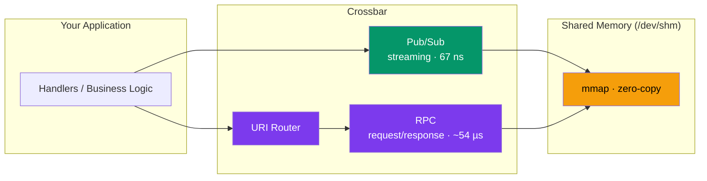
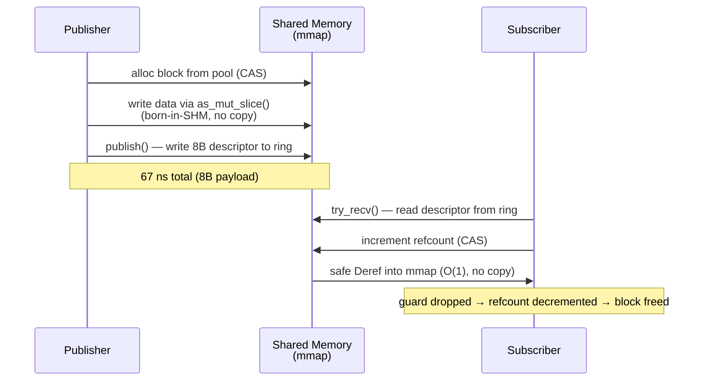
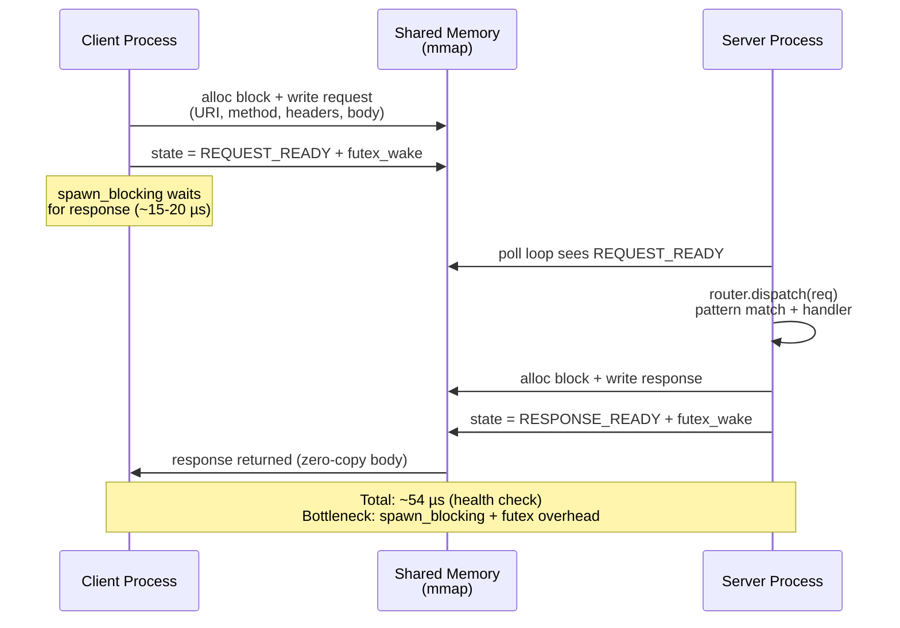

# crossbar

[](https://github.com/userFRM/crossbar/actions/workflows/ci.yml)
[](LICENSE-MIT)
[](https://www.rust-lang.org)

**High-performance IPC framework for Rust.** Two data paths over shared memory: **pub/sub** for streaming (67 ns) and **RPC** for request/response with URI routing (~54 µs). All latency numbers measured in-process via Criterion; real cross-process latency includes kernel scheduling.

---

## What is crossbar?

Crossbar moves data between processes on the same machine. It provides two ways to do this, each designed for a different use case:



| | Pub/Sub | RPC |
|---|---|---|
| **Purpose** | Stream raw bytes between processes | Request/response with URI routing |
| **Latency** | **67 ns** | ~54 µs |
| **Pattern** | Publisher → Subscriber(s) | Client → Router → Handler → Response |
| **Data format** | Raw `&[u8]` (you decide the format) | Structured `Request` / `Response` |
| **Routing** | Topic string (e.g. `"prices/AAPL"`) | URI patterns (e.g. `/tick/:symbol`) |
| **When to use** | Market data, sensor feeds, streaming | REST-like APIs, command/control |

> [!NOTE]
> Crossbar is **not** an HTTP framework. It uses shared memory (`/dev/shm`) for
> inter-process communication on the same host. If you need HTTP, use
> [axum](https://github.com/tokio-rs/axum).

---

## Pub/Sub — zero-copy streaming (67 ns)

The fastest way to move data between processes. Publisher writes bytes directly into shared memory, then transfers ownership to subscribers by writing an 8-byte descriptor to a ring buffer. Subscribers read the data in-place via safe `Deref` — no copies, no `unsafe`.



### Code

```rust
use crossbar::prelude::*;

// Publisher process
let mut pub_ = ShmPoolPublisher::create("market", PoolPubSubConfig::default())?;
let topic = pub_.register("prices/AAPL")?;

let mut loan = pub_.loan(&topic);                       // alloc block
loan.as_mut_slice()[..8].copy_from_slice(&price_bytes);  // write directly into SHM
loan.set_len(8);
loan.publish();                                          // 67 ns — O(1) transfer
```

```rust
// Subscriber process
let sub = ShmPoolSubscriber::connect("market")?;
let mut stream = sub.subscribe("prices/AAPL")?;

if let Some(guard) = stream.try_recv() {
    let data: &[u8] = &*guard;    // safe Deref — reads directly from mmap
    println!("price: {}", f64::from_le_bytes(data[..8].try_into().unwrap()));
}
// guard dropped → block freed back to pool
```

### Performance

| Payload | Latency | Throughput |
|---|---|---|
| 8 B | **67 ns** | — |
| 64 KB | 1.40 µs | **45.6 GiB/s** |
| 1 MB | 32.6 µs | **29.7 GiB/s** |

The 67 ns is the end-to-end cost for 8 bytes. The *transfer* (writing the 8B descriptor to the ring) is always O(1) regardless of payload size. Larger payloads add the cost of writing data into the SHM block (O(n)).

### Why 67 ns? (1.5x faster than iceoryx2)

| Optimization | Savings |
|---|---|
| **Smart wake** — checks atomic waiters counter (~2 ns) instead of `futex_wake` syscall (~170 ns) | ~170 ns |
| **Counter-based heartbeat** — checks clock every 1024 loans, not every call | ~20 ns/call |
| **Inline hot paths** — `alloc_block`, `commit`, `try_recv` are `#[inline]` | cache locality |
| **Minimal coordination** — seqlock + refcount + Treiber stack, no service discovery | structural |

---

## RPC — request/response with URI routing (~54 µs)

When you need to call a function in another process by URI. Define handlers with path patterns, register them on a router, serve over shared memory.



### Code

```rust
use crossbar::prelude::*;

// Define handlers — same as any web framework
async fn health() -> &'static str { "ok" }

async fn get_tick(req: Request) -> Json<serde_json::Value> {
    let symbol = req.path_param("symbol").unwrap_or("???");
    Json(serde_json::json!({ "symbol": symbol, "price": 152.50 }))
}

// Server process
let router = Router::new()
    .route("/health", get(health))
    .route("/tick/:symbol", get(get_tick));
ShmServer::spawn("myapp", router).await?;

// Client process
let client = ShmClient::connect("myapp").await?;
let resp = client.get("/tick/AAPL").await?;
```

### Why ~54 µs?

The data transfer itself is O(1) (block pool with zero-copy reads). The latency comes from coordination overhead that pub/sub does not have:

| Step | Cost | Pub/Sub equivalent |
|---|---|---|
| `spawn_blocking` (tokio threadpool) | ~15-20 µs | not used |
| Futex wake/wait round-trips (×2) | ~2-4 µs | smart wake (~2 ns) |
| Request serialization (URI + headers + body) | ~1-2 µs | raw bytes only |
| Router dispatch (pattern matching) | ~152 ns | no routing |
| Server poll sleep (idle cycles) | 0-1 µs | subscriber polls directly |
| CAS state transitions (×5) | ~500 ns | seqlock (2 stores) |

> [!NOTE]
> The roadmap includes a **dedicated SHM poller** that eliminates `spawn_blocking`
> and the tokio runtime from the hot path, targeting sub-10 µs RPC latency.

### In-process shortcut

For testing or same-process dispatch, `InProcessClient` calls the router directly — no shared memory, no serialization:

```rust
let client = InProcessClient::new(router.clone());
let resp = client.get("/health").await;  // ~152 ns
```

---

## Installation

```toml
[dependencies]
crossbar = "0.1"
tokio = { version = "1", features = ["rt-multi-thread", "macros"] }
```

For shared memory (Unix only):

```toml
crossbar = { version = "0.1", features = ["shm"] }
```

---

## Handler system

### Async handlers

```rust
async fn health() -> &'static str { "ok" }
async fn echo(req: Request) -> Vec<u8> { req.body.to_vec() }
```

### Sync handlers

```rust
let router = Router::new()
    .route("/health", get(sync_handler(|| "ok")))
    .route("/echo", post(sync_handler_with_req(|req: Request| {
        format!("got {} bytes", req.body.len())
    })));
```

### `#[handler]` proc macro

```rust
use crossbar::handler;

#[handler]
async fn get_tick(
    #[path("symbol")] symbol: String,
    #[query("venue")] venue: Option<String>,
    #[body] filters: Filters,
) -> Json<TickData> {
    // symbol, venue, filters extracted automatically
    // missing required params return 400
}
```

| Attribute | Type | On missing |
|---|---|---|
| `#[path("name")]` | `String` / `Option<String>` | 400 / `None` |
| `#[query("name")]` | `String` / `Option<String>` | 400 / `None` |
| `#[body]` | `T: Deserialize` | 400 |
| *(none)* | `Request` | passthrough |

### Return types (`IntoResponse`)

| Return type | Status | Body |
|---|---|---|
| `&'static str` | 200 | text |
| `String` | 200 | text |
| `Vec<u8>` / `Body` | 200 | raw bytes |
| `Json<T: Serialize>` | 200 | JSON |
| `(u16, &str)` / `(u16, String)` | custom | text |
| `Result<R, E>` | delegates | delegates |
| `Response` | passthrough | passthrough |

---

## Benchmarks

Full methodology and results in [BENCHMARKS.md](BENCHMARKS.md). Run on your hardware:

```sh
cargo bench --features shm
```

### Pub/Sub

| Mode | Latency |
|---|---|
| `publish()` + `try_recv()` (smart wake) | **67 ns** |
| `publish_silent()` + `try_recv()` | **65 ns** |

| Payload | Throughput |
|---|---|
| 64 KB | **45.6 GiB/s** |
| 1 MB | **29.7 GiB/s** |

### RPC

| Benchmark | In-process | SHM |
|---|---|---|
| `/health` (2B) | 152 ns | 53.5 µs |
| 64 KB response | 1.19 µs | 55.8 µs |
| 1 MB response | 16.97 µs | 72.7 µs |

---

## How crossbar compares

### vs iceoryx2

[iceoryx2](https://github.com/eclipse-iceoryx/iceoryx2) is a `no_std` zero-copy shared memory middleware. Both frameworks use the same core pattern: transfer a pointer/offset over shared memory instead of copying data. Crossbar's pub/sub is an apples-to-apples comparison.

| | crossbar pub/sub | iceoryx2 |
|---|---|---|
| **O(1) latency** | **67 ns** | ~100 ns |
| **Descriptor size** | 8 bytes | ~8 bytes |
| **Subscriber reads** | Safe `Deref` (refcounted) | Safe API |
| **`no_std`** | No | Yes |
| **Cross-language** | No | Yes (C/C++) |
| **RPC / routing** | Yes (separate path) | No |

### vs axum / actix-web

Crossbar provides URI routing without HTTP. If your service talks to browsers, use axum. If your services talk to each other on the same host, crossbar removes HTTP overhead.

### vs raw Unix IPC

Crossbar adds URI-based routing and zero-copy pub/sub on top of shared memory. Without it, you'd build your own message framing, request dispatching, and serialization.

---

## Configuration

### Pub/Sub (`PoolPubSubConfig`)

| Field | Default | Description |
|---|---|---|
| `max_topics` | 16 | Maximum concurrent topics |
| `block_count` | 256 | Pool blocks available |
| `block_size` | 64 KiB | Bytes per block (usable: block_size - 8) |
| `ring_depth` | 8 | Samples remembered before overwrite |
| `heartbeat_interval` | 100 ms | How often publisher signals liveness |
| `stale_timeout` | 5 s | Publisher considered dead after this |

### RPC (`ShmConfig`)

| Field | Default | Description |
|---|---|---|
| `slot_count` | 64 | Concurrent in-flight requests |
| `block_count` | 192 | Pool blocks for request/response data |
| `block_size` | 64 KiB | Bytes per block |
| `heartbeat_interval` | 100 ms | Server liveness signal interval |
| `stale_timeout` | 5 s | Server considered dead after this |

---

## Project layout

```
crossbar/
  src/
    lib.rs              Crate root, prelude
    router.rs           URI pattern matching, route registration
    handler.rs          Handler trait, sync wrappers, BoxedHandler
    types.rs            Request, Response, Uri, Method, Body, IntoResponse, Json
    error.rs            CrossbarError enum
    transport/
      mod.rs            Transport module, SHM serialization helpers
      inproc.rs         InProcessClient (direct dispatch)
      shm/
        mod.rs          ShmServer, ShmClient, ShmHandle
        mmap.rs         Raw mmap wrappers (MAP_POPULATE, MADV_HUGEPAGE)
        region.rs       V2 memory-mapped region, block pool allocator
        notify.rs       Futex (Linux) / polling (macOS) wait/wake
        pubsub.rs       ShmPublisher, ShmSubscriber (ring-based, legacy)
        pool_pubsub.rs  ShmPoolPublisher, ShmPoolSubscriber (O(1) pub/sub)
  crossbar-macros/      #[handler] and #[derive(IntoResponse)] proc macros
  examples/
    demo.rs             In-process + SHM latency comparison
  tests/                256 tests (transport, stress, routing, handler, macros, types, doc-tests)
  benches/
    transport.rs        Criterion benchmarks
```

---

## Roadmap

- **Dedicated SHM poller** — eliminate `spawn_blocking` from RPC, targeting sub-10 µs
- **Pub/sub-backed RPC** — route requests over the pub/sub transport for ~200-500 ns RPC
- **HTTP bridge** — serve crossbar routes over hyper/axum
- **Middleware** — composable interceptors (logging, auth, metrics)

---

## Contributing

```sh
cargo fmt --all -- --check
cargo clippy --workspace --all-targets --features shm -- -D warnings
cargo test --workspace --features shm
```

---

## License

Licensed under either of

- **MIT License** ([LICENSE-MIT](LICENSE-MIT) or <http://opensource.org/licenses/MIT>)
- **Apache License, Version 2.0** ([LICENSE-APACHE](LICENSE-APACHE) or <http://www.apache.org/licenses/LICENSE-2.0>)

at your option.
