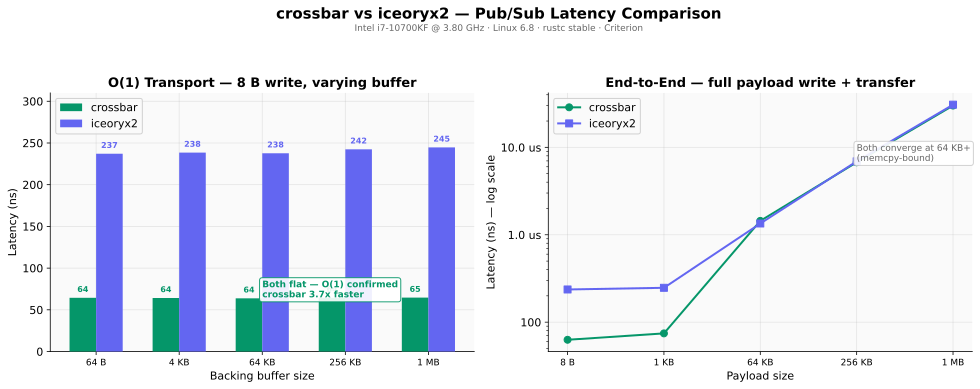
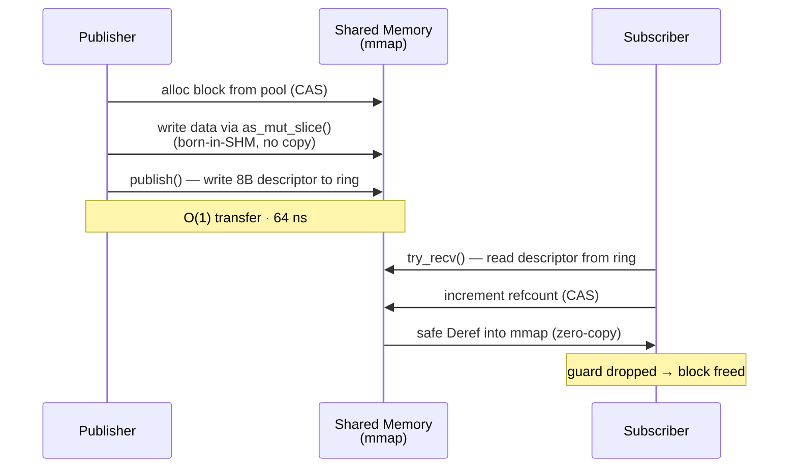
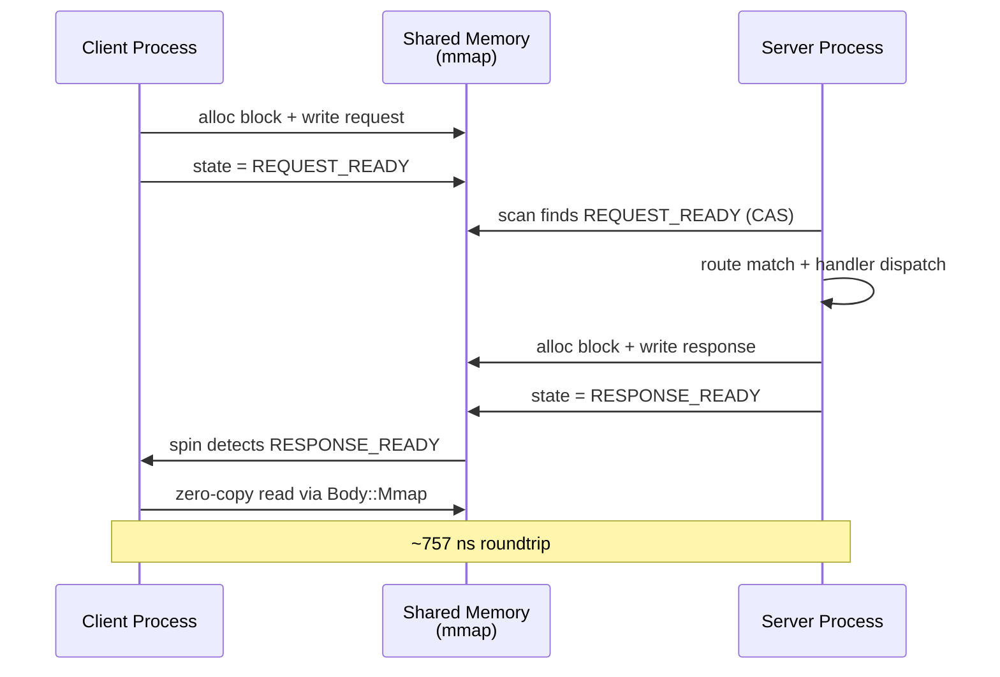
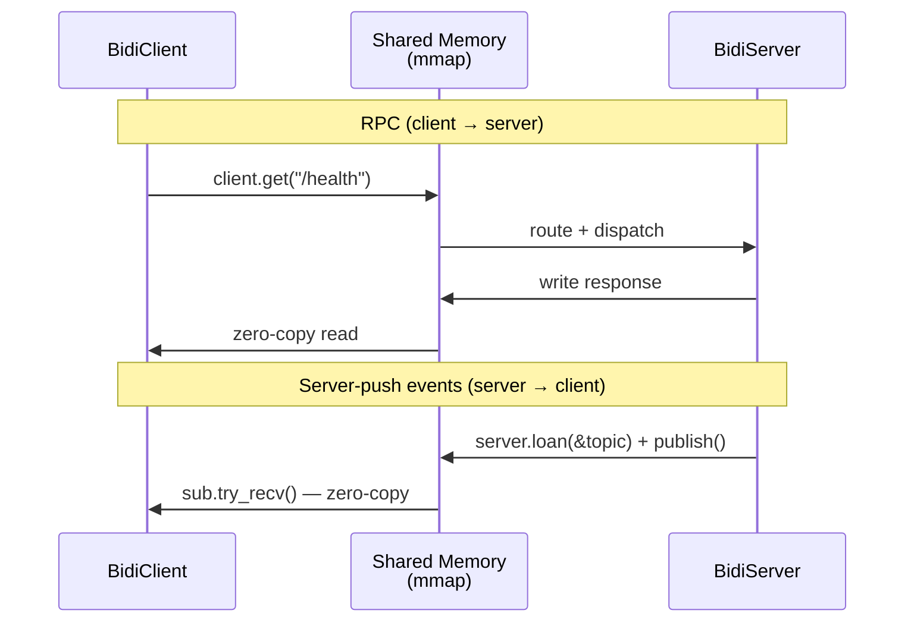
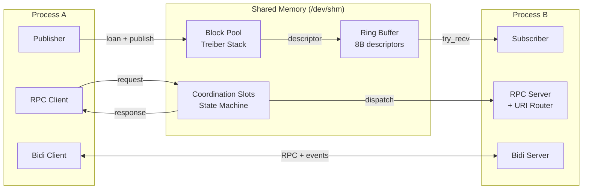

# crossbar

[](https://github.com/userFRM/crossbar/actions/workflows/ci.yml)
[](LICENSE-MIT)
[](https://www.rust-lang.org)

**Zero-copy IPC for Rust with REST-like routing.** Define endpoints with URI patterns and path params — as simple as building a web API, but over shared memory with constant-latency O(1) transport.

> [!NOTE]
> Crossbar is **not** an HTTP server. It moves data between processes on the same
> machine via shared memory (`/dev/shm`). Think of it as axum semantics
> (routes, handlers, extractors) without the network stack. If you need HTTP, use
> [axum](https://github.com/tokio-rs/axum).

---

## Performance



**Left:** O(1) transport proof — we write a fixed 8 bytes into backing buffers from 64 B to 1 MB. Latency is flat for both frameworks. The transfer (writing an 8-byte descriptor to a ring) is always O(1). Crossbar is **3.7x faster** (64 ns vs 237 ns).

**Right:** End-to-end with full payload — both write the entire payload into SHM before transfer. At small sizes, crossbar's lower overhead wins. At 64 KB+, both converge to the same speed because `memcpy` dominates.

Both benchmarks use the same operations: `loan buffer` -> `write data` -> `publish` -> `receive` -> `deref`. Apples-to-apples, same process, same Criterion harness.

> **Benchmark system:** Intel i7-10700KF @ 3.80 GHz, Linux 6.8, rustc stable.
> iceoryx2 claims ~100 ns on an i7-13700H — our 237 ns measurement reflects our
> older hardware. Run on yours: `cargo bench --features shm -- "head_to_head"`

---

## Quick start

### Pub/sub — two processes, one topic



**Publisher** writes price data directly into shared memory:

```rust
// publisher.rs
use crossbar::prelude::*;

fn main() -> Result<(), Box<dyn std::error::Error>> {
    let mut pub_ = ShmPoolPublisher::create("market", PoolPubSubConfig::default())?;
    let topic = pub_.register("prices/AAPL")?;

    loop {
        let price: f64 = get_price(); // your data source

        let mut loan = pub_.loan(&topic);                        // alloc block from pool
        loan.as_mut_slice()[..8].copy_from_slice(&price.to_le_bytes()); // write into SHM
        loan.set_len(8);
        loan.publish();                                          // transfer ownership — O(1)
    }
}
```

**Subscriber** reads the data in-place — zero copies, no `unsafe`:

```rust
// subscriber.rs
use crossbar::prelude::*;

fn main() -> Result<(), Box<dyn std::error::Error>> {
    let sub = ShmPoolSubscriber::connect("market")?;
    let mut stream = sub.subscribe("prices/AAPL")?;

    loop {
        if let Some(guard) = stream.try_recv() {
            let data: &[u8] = &*guard;  // safe Deref — reads directly from mmap
            let price = f64::from_le_bytes(data[..8].try_into().unwrap());
            println!("AAPL: {price:.2}");
        }
        // guard dropped -> block freed back to pool
    }
}
```

Run both in separate terminals:

```sh
cargo run --example pubsub_publisher --features shm
cargo run --example pubsub_subscriber --features shm
```

### RPC — request/response with URI routing

When you need to call a function in another process by URI. Same patterns as any web framework — path params, query strings, JSON bodies — but over shared memory:



```rust
use crossbar::prelude::*;

// Define handlers — same as building a REST API
async fn health() -> &'static str { "ok" }

async fn get_tick(req: Request) -> Response {
    let symbol = req.path_param("symbol").unwrap_or("???");
    // Use any serializer: sonic_rs, serde_json, simd-json, rkyv, raw bytes...
    let body = format!(r#"{{"symbol":"{}","price":152.50}}"#, symbol);
    Response::ok().with_body(body)
}

// Server process
let router = Router::new()
    .route("/health", get(health))
    .route("/tick/:symbol", get(get_tick));
ShmServer::spawn("myapp", router).await?;

// Client process (can be a different binary)
let client = ShmClient::connect("myapp").await?;
let resp = client.get("/tick/AAPL").await?;
```

RPC latency is ~757 ns for `/health`. The data transfer is O(1) (same mechanism as pub/sub). The extra cost is coordination — slot state machine, route matching, request/response serialization. The body is opaque `&[u8]` — bring your own serializer.

### In-process (for testing)

Skip shared memory entirely — call handlers directly:

```rust
let client = InProcessClient::new(router);
let resp = client.get("/health").await;  // ~143 ns
```

### Bidirectional — RPC + streaming events

`BidiServer` combines RPC with server-push events. The server handles requests AND pushes events to clients on named topics:



```rust
use crossbar::prelude::*;

// Server: handles RPC + pushes events
let router = Router::new().route("/health", get(|| async { "ok" }));
let mut server = BidiServer::spawn("myapp", router).await?;

// Register topics and push events
let price_topic = server.register("/prices/AAPL")?;
let mut loan = server.loan(&price_topic);
loan.set_data(b"152.50");
loan.publish();

// Client: makes RPC calls + receives events
let client = BidiClient::connect("myapp").await?;
let resp = client.get("/health").await?;              // RPC

let mut sub = client.subscribe("/prices/AAPL")?;      // event stream
if let Some(sample) = sub.try_recv() {
    println!("price: {}", std::str::from_utf8(&*sample).unwrap());
}
```

---

## How it works



Both pub/sub and RPC use the same underlying mechanism:

1. **Allocate** a block from a lock-free pool (Treiber stack CAS)
2. **Write** data directly into the mmap'd block (born-in-SHM)
3. **Transfer** ownership by writing an 8-byte descriptor (O(1))
4. **Read** on the other side via safe `Deref` into mmap (O(1), zero-copy)
5. **Free** the block back to the pool when the guard is dropped

This is the same pattern as [iceoryx2](https://github.com/eclipse-iceoryx/iceoryx2). Both use ring buffers for pub/sub and shared memory pools for block allocation. The difference is what sits *above* the transport:

| | crossbar | iceoryx2 |
|---|---|---|
| **Transport** | **64 ns** | ~237 ns (our hw) / ~100 ns (theirs) |
| **Pool allocator** | Treiber stack (lock-free CAS) | Lock-free pool |
| **Above transport** | URI router with path params | Service discovery + POSIX config |
| **API style** | REST-like (routes, handlers, extractors) | Typed pub/sub channels |
| **RPC / routing** | Built-in | Not included |
| **`no_std`** | No | Yes |
| **Cross-language** | Planned (Python, C++, Go) | Yes (C/C++, Python) |
| **Platforms** | Linux, macOS | Linux, macOS, Windows, QNX, ... |

Crossbar is faster because it skips iceoryx2's service discovery and POSIX configuration layer — it goes straight from user code to atomics. The tradeoff: iceoryx2 supports more platforms and languages today.

---

## Handler system

### Async and sync handlers

```rust
async fn health() -> &'static str { "ok" }
async fn echo(req: Request) -> Vec<u8> { req.body.to_vec() }
```

```rust
let router = Router::new()
    .route("/health", get(sync_handler(|| "ok")))
    .route("/echo", post(sync_handler_with_req(|req: Request| {
        format!("got {} bytes", req.body.len())
    })));
```

### `#[handler]` proc macro

```rust
use crossbar::handler;

#[handler]
async fn get_tick(
    #[path("symbol")] symbol: String,
    #[query("venue")] venue: Option<String>,
    #[body] filters: Filters,
) -> Json<TickData> {
    // symbol, venue, filters extracted automatically
    // missing required params return 400
}
```

| Attribute | Type | On missing |
|---|---|---|
| `#[path("name")]` | `String` / `Option<String>` | 400 / `None` |
| `#[query("name")]` | `String` / `Option<String>` | 400 / `None` |
| `#[body]` | `T: Deserialize` | 400 |
| *(none)* | `Request` | passthrough |

### Return types (`IntoResponse`)

| Return type | Status | Body |
|---|---|---|
| `&'static str` | 200 | text |
| `String` | 200 | text |
| `Vec<u8>` / `Body` | 200 | raw bytes |
| `Json<T: Serialize>` | 200 | JSON |
| `(u16, &str)` / `(u16, String)` | custom | text |
| `Result<R, E>` | delegates | delegates |
| `Response` | passthrough | passthrough |

---

## Installation

```toml
[dependencies]
crossbar = { version = "0.1", features = ["shm"] }
tokio = { version = "1", features = ["rt-multi-thread", "macros"] }
```

The `shm` feature enables shared memory transport (Unix only). Without it, only `InProcessClient` is available.

---

## Configuration

### Pub/Sub (`PoolPubSubConfig`)

| Field | Default | Description |
|---|---|---|
| `max_topics` | 16 | Maximum concurrent topics |
| `block_count` | 256 | Pool blocks available |
| `block_size` | 64 KiB | Bytes per block (usable: block_size - 8) |
| `ring_depth` | 8 | Samples before overwrite |
| `heartbeat_interval` | 100 ms | Publisher liveness signal |
| `stale_timeout` | 5 s | Publisher considered dead after this |

### RPC (`ShmConfig`)

| Field | Default | Description |
|---|---|---|
| `slot_count` | 64 | Concurrent in-flight requests |
| `block_count` | 192 | Pool blocks for request/response data |
| `block_size` | 64 KiB | Bytes per block |
| `heartbeat_interval` | 100 ms | Server liveness signal |
| `stale_timeout` | 5 s | Server considered dead after this |

---

## Benchmarks

Full methodology and results in [BENCHMARKS.md](BENCHMARKS.md).

### Pub/Sub latency

| Mode | Latency |
|---|---|
| `publish()` + `try_recv()` (smart wake) | **67 ns** |
| `publish_silent()` + `try_recv()` | **65 ns** |

### Pub/Sub throughput

| Payload | Throughput |
|---|---|
| 64 KB | **45.6 GiB/s** |
| 1 MB | **29.7 GiB/s** |

### RPC latency

| Benchmark | In-process | SHM | SHM overhead |
|---|---|---|---|
| `/health` (2B) | 143 ns | **757 ns** | 614 ns |
| OHLC (JSON + path params) | 937 ns | 1.63 us | 693 ns |
| POST JSON body | 1.26 us | 1.86 us | 600 ns |
| 64 KB response | 1.28 us | 1.96 us | 680 ns |
| 1 MB response | 18.3 us | 18.9 us | 600 ns |

The SHM overhead is a flat **~600-700 ns** regardless of payload size. Larger payloads add the cost of writing data *into* the SHM block, but the *transfer* is always O(1).

---

## Project layout

```
crossbar/
  src/
    lib.rs              Crate root, prelude
    router.rs           URI pattern matching, route registration
    handler.rs          Handler trait, sync wrappers, BoxedHandler
    types.rs            Request, Response, Uri, Method, Body, IntoResponse, Json
    error.rs            CrossbarError enum
    transport/
      mod.rs            Transport module, SHM serialization helpers
      inproc.rs         InProcessClient (direct dispatch)
      shm/
        mod.rs          ShmServer, ShmClient, ShmHandle
        mmap.rs         Raw mmap wrappers (MAP_POPULATE, MADV_HUGEPAGE)
        region.rs       Memory-mapped region, block pool allocator
        notify.rs       Futex (Linux) / polling (macOS) wait/wake
        pubsub.rs       ShmPublisher, ShmSubscriber (seqlock-based pub/sub)
        pool_pubsub.rs  ShmPoolPublisher, ShmPoolSubscriber (O(1) pool pub/sub)
        bidi.rs         BidiServer, BidiClient (RPC + server-push events)
  crossbar-macros/      #[handler] and #[derive(IntoResponse)] proc macros
  examples/
    demo.rs             In-process + SHM latency comparison
    pubsub_publisher.rs Cross-process pub/sub publisher
    pubsub_subscriber.rs Cross-process pub/sub subscriber
  tests/                Integration and stress tests
  benches/
    transport.rs        Criterion benchmarks (including iceoryx2 head-to-head)
```

---

## Language bindings

Crossbar's shared memory layout is a stable binary format. Any language that can `mmap` a file and do atomic operations can interoperate.

| Language | Status | Location |
|---|---|---|
| Rust | done | `src/` |
| C | done | `crossbar-ffi/` (cdylib + staticlib + header) |
| C++ | done | `bindings/cpp/` (header-only RAII, C++17) |
| Python | done | `bindings/python/` (ctypes) |
| Go | done | `bindings/go/` (cgo) |
| Zig | planned | — |

---

## Contributing

```sh
cargo fmt --all -- --check
cargo clippy --workspace --all-targets --features shm -- -D warnings
cargo test --workspace --features shm
```

---

## License

Licensed under either of

- **MIT License** ([LICENSE-MIT](LICENSE-MIT) or <http://opensource.org/licenses/MIT>)
- **Apache License, Version 2.0** ([LICENSE-APACHE](LICENSE-APACHE) or <http://www.apache.org/licenses/LICENSE-2.0>)

at your option.
