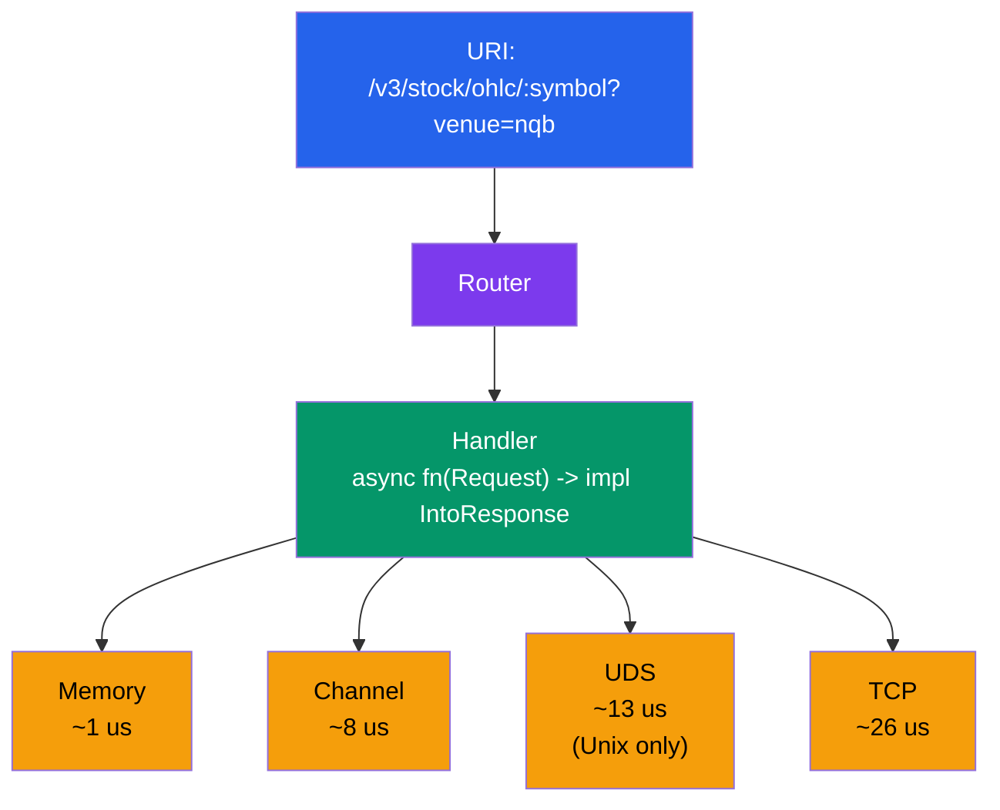
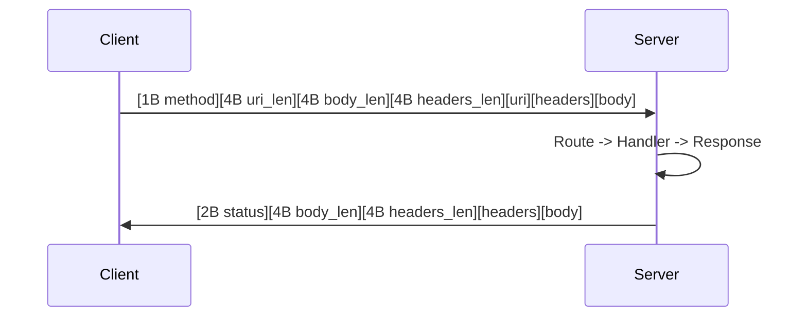
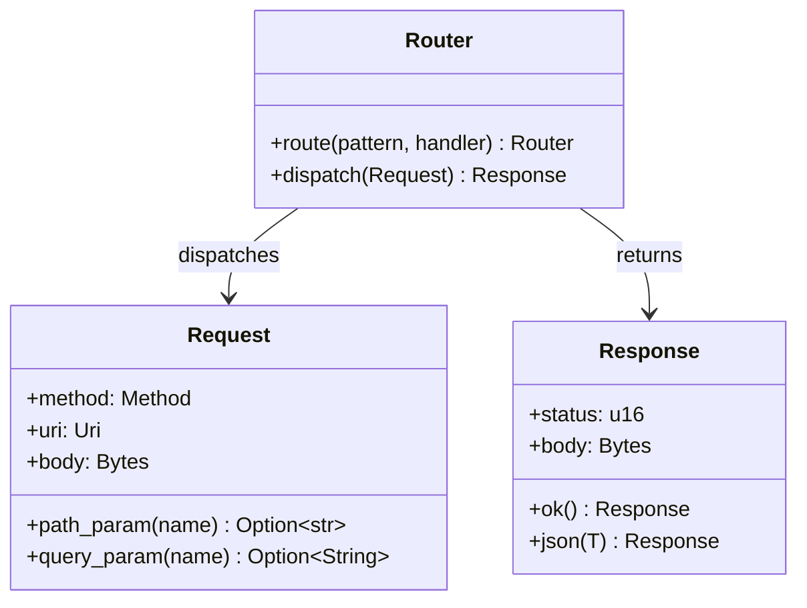

# Crossbar

<!-- badges placeholder -->
[](https://www.rust-lang.org)
[](#license)

**Transport-polymorphic URI router for Rust. Define handlers once, serve them across in-process, channel, UDS, and TCP transports.**

Crossbar lets you define your request handlers and URI routes exactly once, then serve them over any combination of transports -- in-process memory, tokio channels, Unix domain sockets, or raw TCP -- with zero code changes. The same router, the same handlers, the same URIs, running at the speed each transport allows: sub-microsecond for in-process calls, single-digit microseconds across tasks, and low double-digits over the network.

---

## Features

- **Transport polymorphism** -- one `Router` drives four transports out of the box (Memory, Channel, UDS, TCP)
- **URI pattern matching** with `:param` extraction and query string parsing
- **Binary wire protocol** -- length-prefixed request/response frames with header support, body passed as `Bytes`
- **Axum-inspired handler system** -- `async fn(Request) -> impl IntoResponse` with a rich `IntoResponse` trait
- **Synchronous handler support** -- `sync_handler()` and `sync_handler_with_req()` for non-async functions
- **Sub-microsecond in-process dispatch** via `MemoryClient` (direct function call, no serialization)
- **Persistent connections** with keep-alive for UDS and TCP transports
- **JSON and binary body support** -- `Json<T>` wrapper for automatic serde, raw `Bytes` for everything else
- **`#[handler]` proc macro** -- convenience extraction for path/query parameters and JSON body (see [Proc Macro](#handler-proc-macro) below)
- **`TCP_NODELAY`** enabled by default for low-latency networking (Nagle's algorithm disabled)
- **UDS transport** -- available on Unix platforms only (`#[cfg(unix)]`)

---

## Architecture



**Router** holds an `Arc<Vec<Route>>`, each pairing a `Method` + `PathPattern` with a type-erased `BoxedHandler`. On dispatch, it iterates routes in registration order, matches the method and path segments, extracts `:param` captures into the request, and calls the handler.

**Handlers** are any `async fn` (or sync function wrapped in `sync_handler`) that returns `impl IntoResponse`. The `Handler` trait uses a marker-type trick (similar to axum) to support both zero-argument handlers (`async fn() -> R`) and single-argument handlers (`async fn(Request) -> R`) without ambiguity.

**Transports** share the same binary wire protocol for UDS and TCP. Memory and Channel transports skip serialization entirely -- the `Request` struct is passed directly.

---

## Quick Start

Add to your `Cargo.toml`:

```toml
[dependencies]
crossbar = { path = "." }  # or your registry/git source
tokio = { version = "1", features = ["rt-multi-thread", "macros"] }
serde = { version = "1", features = ["derive"] }
serde_json = "1"
```

Minimal example -- router with an in-process memory client:

```rust
use crossbar::prelude::*;

async fn hello(req: Request) -> String {
    let name = req.path_param("name").unwrap_or("world");
    format!("Hello, {}!", name)
}

#[tokio::main]
async fn main() {
    let router = Router::new()
        .route("/hello/:name", get(hello));

    let client = MemoryClient::new(router);

    let resp = client.get("/hello/crossbar").await;
    assert_eq!(resp.status, 200);
    assert_eq!(resp.body_str(), "Hello, crossbar!");
}
```

---

## Full Example

The included `examples/demo.rs` demonstrates all four transports serving the same routes (UDS section runs on Unix only). Run it with:

```bash
cargo run --release --example demo
```

```rust
use serde::{Deserialize, Serialize};
use crossbar::prelude::*;

// Define handlers once -----------------------------------------------

async fn health() -> &'static str {
    "ok"
}

#[derive(Serialize)]
struct OhlcData {
    symbol: String,
    venue: String,
    open: f64,
    high: f64,
    low: f64,
    close: f64,
    volume: u64,
}

async fn get_ohlc(req: Request) -> Json<OhlcData> {
    let symbol = req.path_param("symbol").unwrap_or("???").to_string();
    let venue = req.query_param("venue").unwrap_or_else(|| "default".into());
    Json(OhlcData {
        symbol, venue,
        open: 150.25, high: 155.80, low: 149.10, close: 153.42,
        volume: 48_392_100,
    })
}

#[derive(Deserialize)]
struct OrderRequest { symbol: String, side: String, qty: u32 }

#[derive(Serialize)]
struct OrderResponse { order_id: String, symbol: String, side: String, qty: u32, status: String }

async fn create_order(req: Request) -> Result<Json<OrderResponse>, (u16, &'static str)> {
    let order: OrderRequest = req.json_body().map_err(|_| (400u16, "invalid JSON body"))?;
    Ok(Json(OrderResponse {
        order_id: "ORD-000042".into(),
        symbol: order.symbol, side: order.side, qty: order.qty,
        status: "filled".into(),
    }))
}

#[tokio::main]
async fn main() -> Result<(), Box<dyn std::error::Error>> {
    let router = Router::new()
        .route("/health", get(health))
        .route("/v3/stock/snapshot/ohlc/:symbol", get(get_ohlc))
        .route("/v3/stock/order", post(create_order));

    // 1. Memory -- in-process, sub-microsecond
    let mem = MemoryClient::new(router.clone());
    let r = mem.get("/v3/stock/snapshot/ohlc/AAPL?venue=nqb").await;
    println!("Memory:  {} {}", r.status, r.body_str());

    // 2. Channel -- cross-task via tokio::mpsc
    let chan = ChannelServer::spawn(router.clone());
    let r = chan.get("/health").await.unwrap();
    println!("Channel: {} {}", r.status, r.body_str());

    // 3. Unix Domain Socket -- cross-process, same host (Unix only)
    #[cfg(unix)]
    {
        let uds_path = "/tmp/crossbar-demo.sock";
        tokio::spawn({
            let r = router.clone();
            async move { UdsServer::bind(uds_path, r).await.unwrap() }
        });
        tokio::time::sleep(std::time::Duration::from_millis(30)).await;
        let uds = UdsClient::connect(uds_path).await?;
        let r = uds.get("/health").await?;
        println!("UDS:     {} {}", r.status, r.body_str());
    }

    // 4. TCP -- networked, with TCP_NODELAY
    let tcp_addr = "127.0.0.1:19876";
    tokio::spawn({
        let r = router.clone();
        async move { TcpServer::bind(tcp_addr, r).await.unwrap() }
    });
    tokio::time::sleep(std::time::Duration::from_millis(30)).await;
    let tcp = TcpClient::connect(tcp_addr).await?;
    let r = tcp.get("/health").await?;
    println!("TCP:     {} {}", r.status, r.body_str());

    Ok(())
}
```

---

## Wire Protocol

Crossbar uses a binary framing protocol for UDS and TCP transports. No HTTP overhead, no text parsing -- length-prefixed frames with optional headers.



### Request Frame (13 + N + H + M bytes)

```
+--------+------------------+------------------+---------------------+-----------+---------------+-----------+
| Method | URI Length (LE)   | Body Length (LE)  | Headers Length (LE) | URI bytes | Headers bytes | Body bytes|
| 1 byte | 4 bytes          | 4 bytes           | 4 bytes             | N bytes   | H bytes       | M bytes   |
+--------+------------------+------------------+---------------------+-----------+---------------+-----------+
```

### Response Frame (10 + H + M bytes)

```
+------------------+------------------+---------------------+---------------+-----------+
| Status (LE)      | Body Length (LE)  | Headers Length (LE) | Headers bytes | Body bytes|
| 2 bytes          | 4 bytes           | 4 bytes             | H bytes       | M bytes   |
+------------------+------------------+---------------------+---------------+-----------+
```

### Headers Section

The headers section is a sequence of key-value pairs:

```
+-------------------+------------------------------------------+
| Count (LE)        | Repeated: [2B key_len LE][key][2B val_len LE][val] |
| 2 bytes           | variable                                 |
+-------------------+------------------------------------------+
```

### Method Encoding

| Byte | Method |
|------|--------|
| `0x00` | GET |
| `0x01` | POST |
| `0x02` | PUT |
| `0x03` | DELETE |
| `0x04` | PATCH |

**Design rationale:** The protocol is intentionally minimal. All integers are little-endian for zero-cost reads on x86/ARM. The body is transferred as raw bytes via `Bytes` (backed by `BytesMut`), enabling zero-copy slicing downstream. Frames are limited to 64 MiB by default (`MAX_FRAME_SIZE`).

---

## Type Relationships



---

## Transport Comparison

| Transport | Avg Latency | Use Case | Connection Model | Platform |
|-----------|-------------|----------|------------------|----------|
| **Memory** | ~1 us | In-process dispatch, testing, embedded routers | Direct function call via `Arc<Router>` | All |
| **Channel** | ~8 us | Cross-task communication within one process | `tokio::mpsc` + `oneshot` reply | All |
| **UDS** | ~13 us | Cross-process on the same host | Persistent connection, keep-alive loop | Unix only (`#[cfg(unix)]`) |
| **TCP** | ~26 us | Networked services, remote hosts | Persistent connection, `TCP_NODELAY` | All |

> Latencies measured on a single machine with `cargo run --release --example demo` (5000 iterations after 500 warmup). These are relative comparisons between transports, not absolute guarantees.

---

## Benchmark Results

Criterion-based benchmarks across all four transports (`cargo bench`):

| Benchmark | Memory | Channel | UDS | TCP |
|-----------|--------|---------|-----|-----|
| health (minimal) | 149 ns | 6.2 us | 10.8 us | 24.0 us |
| ohlc (JSON + params) | 1.15 us | 7.7 us | 15.4 us | 27.6 us |
| post_json | 1.32 us | 8.1 us | 14.7 us | 31.1 us |
| 64KB payload | 1.26 us | 7.7 us | 24.2 us | 38.0 us |
| 1MB payload | 17.3 us | 26.0 us | 214.6 us | 214.4 us |

> Actual numbers depend on hardware. The relative ordering is consistent: Memory < Channel < UDS < TCP.

**Methodology:** Benchmarks use fixed socket paths and ports on localhost. Numbers are from a single machine and should be treated as relative comparisons between transports, not absolute guarantees. UDS/TCP servers use readiness-wait loops instead of arbitrary sleeps.

---

## Handler System

Handlers are async functions that return anything implementing the `IntoResponse` trait. Crossbar supports two async handler signatures and two synchronous handler wrappers:

### Async Handlers

```rust
// Zero arguments -- request is ignored
async fn health() -> &'static str { "ok" }

// One argument -- receives the full Request
async fn greet(req: Request) -> String {
    format!("Hello, {}!", req.path_param("name").unwrap_or("stranger"))
}
```

### Synchronous Handlers

When your handler does not need to be `async`, wrap it with `sync_handler` (zero arguments) or `sync_handler_with_req` (receives the `Request`):

```rust
use crossbar::prelude::*;

fn health() -> &'static str { "ok" }

fn echo(req: Request) -> String {
    format!("got {} bytes", req.body.len())
}

let router = Router::new()
    .route("/health", get(sync_handler(health)))
    .route("/echo", post(sync_handler_with_req(echo)));
```

Sync and async handlers can be freely mixed on the same router.

### `#[handler]` Proc Macro

The `#[handler]` macro provides convenience extraction of `String` and `Option<String>` path/query parameters and JSON body deserialization. It is syntactic sugar, not a full extractor system like Axum's.

```rust
use crossbar::prelude::*;
use crossbar_macros::handler;

#[handler]
async fn get_ohlc(
    #[path("symbol")] symbol: String,
    #[query("venue")] venue: Option<String>,
) -> Json<OhlcData> {
    // symbol and venue are extracted automatically
    // ...
}
```

The macro generates roughly:

```rust
async fn get_ohlc(req: Request) -> impl IntoResponse {
    let symbol: String = match req.path_param("symbol") {
        Some(v) => v.to_string(),
        None => return Response::new(400).with_body("missing path param: symbol"),
    };
    let venue: Option<String> = req.query_param("venue");
    // ... original function body
}
```

Supported extractor attributes:

| Attribute | Type | Description | Behavior on Missing |
|-----------|------|-------------|---------------------|
| `#[path("name")]` | `String` | Extracts a path parameter by name | Returns 400 |
| `#[path("name")]` | `Option<String>` | Extracts a path parameter by name | `None` |
| `#[query("name")]` | `String` | Extracts a query parameter by name | Returns 400 |
| `#[query("name")]` | `Option<String>` | Extracts a query parameter by name | `None` |
| `#[body]` | `T: Deserialize` | Deserializes the request body as JSON | Returns 400 |
| *(none)* | `Request` | Passes the raw `Request` through | -- |

### `IntoResponse` Implementations

| Type | Status | Body |
|------|--------|------|
| `&'static str` | `200` | Text body |
| `String` | `200` | Text body |
| `Bytes` | `200` | Raw bytes |
| `Vec<u8>` | `200` | Raw bytes |
| `Json<T: Serialize>` | `200` | JSON-serialized body |
| `(u16, &'static str)` | Custom | Text body |
| `(u16, String)` | Custom | Text body |
| `Result<R, E>` | `Ok` -> R's status, `Err` -> E's status | Delegates to inner type |
| `Response` | Passthrough | Passthrough |

### Error Handling with `Result`

```rust
async fn create_order(req: Request) -> Result<Json<Order>, (u16, &'static str)> {
    let input: OrderInput = req.json_body()
        .map_err(|_| (400u16, "invalid JSON body"))?;
    let order = process(input);
    Ok(Json(order))
}
```

On success, the handler returns `200` with a JSON body. On failure, it returns `400` with a plain-text error message. No manual `Response` construction needed.

---

## Benchmarking

The demo example includes a built-in latency comparison that runs 5000 iterations (after 500 warmup) across transports (UDS included on Unix only):

```bash
cargo run --release --example demo
```

For criterion-based benchmarks:

```bash
cargo bench
```

---

## Roadmap

- **HTTP transport** -- axum/hyper integration for serving over standard HTTP
- **Connection pooling** -- pooled UDS/TCP clients for concurrent workloads
- **Middleware system** -- composable request/response interceptors (logging, auth, tracing)
- **OpenAPI schema generation** -- derive OpenAPI specs from registered routes

---

## License

Licensed under either of

- **MIT License** ([LICENSE-MIT](LICENSE-MIT) or <http://opensource.org/licenses/MIT>)
- **Apache License, Version 2.0** ([LICENSE-APACHE](LICENSE-APACHE) or <http://www.apache.org/licenses/LICENSE-2.0>)

at your option.
