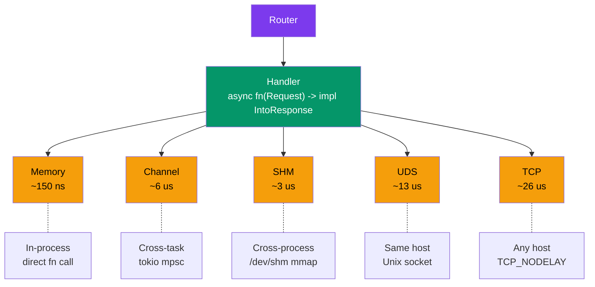
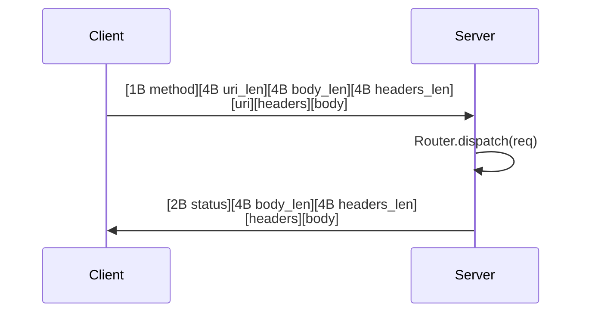

# crossbar

[](https://github.com/userFRM/crossbar/actions/workflows/ci.yml)
[](LICENSE-MIT)
[](https://www.rust-lang.org)

**Define handlers once. Serve over any transport.**

Crossbar is a URI router that decouples your request handlers from the transport layer. Write your routes once, then serve them over in-process memory, tokio channels, shared memory, Unix domain sockets, or TCP -- with zero code changes. Same router, same handlers, same URIs.

```rust
let router = Router::new()
    .route("/health", get(health))
    .route("/tick/:symbol", get(get_tick))
    .route("/echo", post(echo));

// Pick your transport -- the router doesn't care.
MemoryClient::new(router.clone());                        // in-process, ~150 ns
ChannelServer::spawn(router.clone());                     // cross-task, ~6 us
ShmServer::spawn("myapp", router.clone()).await?;         // cross-process, ~3 us
UdsServer::bind("/tmp/myapp.sock", router.clone()).await?; // Unix socket, ~13 us
TcpServer::bind("0.0.0.0:4000", router).await?;          // network, ~26 us
```

---

## Showcase: two binaries, one router

Start the server in one terminal, hit it from another. Same routes, no HTTP, no framework overhead.

**Terminal 1 -- server**

```sh
cargo run --example server
```

```rust
// examples/server.rs
use crossbar::prelude::*;

async fn health() -> &'static str { "ok" }

async fn get_tick(req: Request) -> Json<Tick> {
    let symbol = req.path_param("symbol").unwrap_or("???").to_uppercase();
    Json(Tick { symbol, price: 182.63, volume: 48_392_100, ts: now() })
}

async fn echo(req: Request) -> Vec<u8> { req.body.to_vec() }

#[tokio::main]
async fn main() -> Result<(), Box<dyn std::error::Error>> {
    let router = Router::new()
        .route("/health", get(health))
        .route("/tick/:symbol", get(get_tick))
        .route("/echo", post(echo));

    println!("listening on 127.0.0.1:4000");
    TcpServer::bind("127.0.0.1:4000", router).await?;
    Ok(())
}
```

**Terminal 2 -- client**

```sh
cargo run --example client
```

```rust
// examples/client.rs
use crossbar::prelude::*;

#[tokio::main]
async fn main() -> Result<(), Box<dyn std::error::Error>> {
    let client = TcpClient::connect("127.0.0.1:4000").await?;

    let resp = client.get("/health").await?;
    println!("{} {}", resp.status, resp.body_str());          // 200 ok

    let resp = client.get("/tick/AAPL").await?;
    println!("{} {}", resp.status, resp.body_str());          // 200 {"symbol":"AAPL",...}

    let resp = client.post("/echo", b"hello".to_vec()).await?;
    println!("{} {}", resp.status, resp.body_str());          // 200 hello

    Ok(())
}
```

```
GET /health          -> 200 ok
GET /tick/AAPL       -> 200 {"symbol":"AAPL","price":182.63,"volume":48392100,"ts":1741810438000}
POST /echo           -> 200 hello crossbar
GET /nonexistent     -> 404
```

No HTTP. No JSON overhead on the wire. Just a 13-byte binary header + your payload.

---

## When this is useful

For most web services, use axum or actix. Crossbar targets a different niche:

- **Inter-process communication** where you want URI routing without HTTP overhead
- **Trading systems** that need sub-microsecond in-process dispatch with the option to scale to cross-process later
- **Game servers** with co-located services that communicate on the same host
- **Microservice sidecars** that fan out to local processes before hitting the network
- **Testing** -- swap a TCP transport for `MemoryClient` and run your integration tests without sockets

The key insight: transport choice is an infrastructure decision, not a code decision. Your handlers shouldn't know or care.

---

## Architecture



---

## Transport comparison

| Transport | Latency | Mechanism | Use case | Platform |
|-----------|---------|-----------|----------|----------|
| **Memory** | ~150 ns | Direct `Arc<Router>` call | In-process dispatch, testing | All |
| **Channel** | ~6 us | tokio `mpsc` + `oneshot` | Cross-task within one process | All |
| **SHM** | ~3 us | `mmap` + atomics + futex | Ultra-low-latency cross-process IPC | Unix (`shm` feature) |
| **UDS** | ~13 us | Unix domain socket, keep-alive | Cross-process, same host | Unix |
| **TCP** | ~26 us | Raw TCP, `TCP_NODELAY` | Networked services | All |

> Measured with `cargo bench --features shm` on localhost. Numbers are relative -- run on your hardware for absolutes.

---

## Getting started

### 1. Add the dependency

```toml
[dependencies]
crossbar = "0.1"
tokio = { version = "1", features = ["rt-multi-thread", "macros"] }
```

For shared memory transport (Unix only):

```toml
crossbar = { version = "0.1", features = ["shm"] }
```

### 2. Define your handlers

Handlers are async functions returning anything that implements `IntoResponse`:

```rust
use crossbar::prelude::*;

async fn health() -> &'static str { "ok" }

async fn greet(req: Request) -> String {
    let name = req.path_param("name").unwrap_or("world");
    format!("Hello, {name}!")
}

async fn create_order(req: Request) -> Result<Json<Order>, (u16, &'static str)> {
    let input: OrderInput = req.json_body()
        .map_err(|_| (400u16, "invalid JSON"))?;
    Ok(Json(process(input)))
}
```

### 3. Build the router

```rust
let router = Router::new()
    .route("/health", get(health))
    .route("/greet/:name", get(greet))
    .route("/order", post(create_order));
```

### 4. Serve over any transport

```rust
// In-process (testing, embedded)
let mem = MemoryClient::new(router.clone());
let resp = mem.get("/health").await;

// TCP (production, networked)
TcpServer::bind("0.0.0.0:4000", router).await?;

// UDS (production, same-host)
UdsServer::bind("/tmp/myapp.sock", router).await?;
```

---

## Handler system

Crossbar supports async handlers, sync wrappers, a `#[handler]` proc macro, and a rich `IntoResponse` trait.

### Async handlers

```rust
async fn health() -> &'static str { "ok" }                // zero args
async fn echo(req: Request) -> String { req.body_str() }   // receives Request
```

### Sync handlers

```rust
use crossbar::prelude::*;

let router = Router::new()
    .route("/health", get(sync_handler(|| "ok")))
    .route("/echo", post(sync_handler_with_req(|req: Request| {
        format!("got {} bytes", req.body.len())
    })));
```

### `#[handler]` proc macro

Extract path params, query params, and JSON bodies automatically:

```rust
use crossbar_macros::handler;

#[handler]
async fn get_tick(
    #[path("symbol")] symbol: String,
    #[query("venue")] venue: Option<String>,
    #[body] filters: Filters,
) -> Json<TickData> {
    // symbol, venue, filters extracted automatically
    // missing required params return 400
}
```

| Attribute | Type | On missing |
|-----------|------|------------|
| `#[path("name")]` | `String` / `Option<String>` | 400 / `None` |
| `#[query("name")]` | `String` / `Option<String>` | 400 / `None` |
| `#[body]` | `T: Deserialize` | 400 |
| *(none)* | `Request` | passthrough |

### `IntoResponse` types

| Return type | Status | Body |
|-------------|--------|------|
| `&'static str` | 200 | text |
| `String` | 200 | text |
| `Vec<u8>` / `Bytes` | 200 | raw bytes |
| `Json<T: Serialize>` | 200 | JSON |
| `(u16, &str)` / `(u16, String)` | custom | text |
| `Result<R, E>` | delegates | delegates |
| `Response` | passthrough | passthrough |

---

## Wire protocol

Binary framing for UDS, TCP, and SHM. No HTTP, no text parsing.



13-byte request header, 10-byte response header. All integers little-endian. Max frame size 64 MiB. Body transferred as raw `Bytes` -- zero-copy slicing via `BytesMut::freeze().split_to()`.

---

## Shared memory transport

The `shm` feature adds `ShmServer` and `ShmClient` for cross-process IPC without kernel data copies. Unix only.

```toml
crossbar = { version = "0.1", features = ["shm"] }
```

```rust
// Process A -- server
let router = Router::new().route("/tick", get(get_tick));
ShmServer::bind("myapp", router).await?;

// Process B -- client
let client = ShmClient::connect("myapp").await?;
let resp = client.get("/tick").await?;
```

**How it works:** Server creates a memory-mapped region at `/dev/shm/crossbar-{name}` with 64 request/response slots. Clients acquire slots via atomic CAS, write requests, and wait for responses using a spin-then-futex strategy. No syscalls on the data path.

| Detail | Value |
|--------|-------|
| Slot count | 64 (configurable) |
| Slot capacity | 64 KiB (configurable) |
| Synchronization | spin 100x -> yield 10x -> futex_wait |
| Crash recovery | Server heartbeat + stale slot CAS recovery |

---

## Benchmarks

Criterion benchmarks across all five transports (`cargo bench --features shm`):

| Benchmark | Memory | Channel | SHM | UDS | TCP |
|-----------|--------|---------|-----|-----|-----|
| `/health` (minimal) | 149 ns | 6.2 us | ~2 us | 10.8 us | 24.0 us |
| JSON + path params | 1.15 us | 7.7 us | ~4 us | 15.4 us | 27.6 us |
| POST JSON body | 1.32 us | 8.1 us | ~4 us | 14.7 us | 31.1 us |
| 64 KB payload | 1.26 us | 7.7 us | ~5 us | 24.2 us | 38.0 us |
| 1 MB payload | 17.3 us | 26.0 us | ~25 us | 214.6 us | 214.4 us |

> Run `cargo bench --features shm` on your hardware. The relative ordering is consistent: Memory < SHM < Channel < UDS ~ TCP.

---

## Project layout

```
crossbar/
  src/
    lib.rs              Crate root, prelude
    router.rs           URI pattern matching, route registration
    handler.rs          Handler trait, sync wrappers, BoxedHandler
    types.rs            Request, Response, Uri, Method, IntoResponse, Json
    error.rs            CrossbarError enum
    transport/
      mod.rs            Wire protocol helpers, MAX_FRAME_SIZE
      memory.rs         MemoryClient (direct dispatch)
      channel.rs        ChannelServer, ChannelClient (tokio mpsc)
      tcp.rs            TcpServer, TcpClient (TCP_NODELAY)
      uds.rs            UdsServer, UdsClient (Unix only)
      shm/
        mod.rs          ShmServer, ShmClient, ShmHandle
        region.rs       Memory-mapped region, slot state machine
        notify.rs       Futex (Linux) / polling (macOS) wait/wake
  crossbar-macros/      #[handler] and #[derive(IntoResponse)] proc macros
  examples/
    server.rs           TCP server example
    client.rs           TCP client example
    demo.rs             All-transport latency comparison
  tests/
    transport.rs        47 transport tests (including SHM)
    stress.rs           11 stress/concurrency tests
    routing.rs          31 URI pattern matching tests
    handler.rs          28 handler trait tests
    macros.rs           13 proc macro tests
    types.rs            64 type/serialization tests
  benches/
    transport.rs        Criterion benchmarks across all transports
```

---

## Roadmap

- **HTTP bridge** -- serve crossbar routes over hyper/axum for HTTP compatibility
- **Connection pooling** -- pooled UDS/TCP clients for concurrent workloads
- **Middleware** -- composable request/response interceptors (logging, auth, metrics)
- **WebSocket transport** -- persistent bidirectional communication

---

## License

Licensed under either of

- **MIT License** ([LICENSE-MIT](LICENSE-MIT) or <http://opensource.org/licenses/MIT>)
- **Apache License, Version 2.0** ([LICENSE-APACHE](LICENSE-APACHE) or <http://www.apache.org/licenses/LICENSE-2.0>)

at your option.
