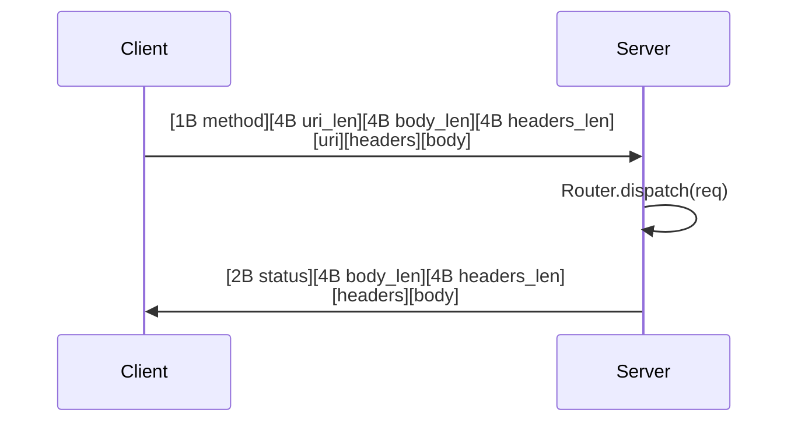

# crossbar

[](https://github.com/userFRM/crossbar/actions/workflows/ci.yml)
[](LICENSE-MIT)
[](https://www.rust-lang.org)

**Define handlers once. Serve over any transport.**

Crossbar is a transport-agnostic URI router for Rust. You write your request handlers once — then serve them over in-process memory, tokio channels, shared memory, Unix domain sockets, or TCP. Switch transports without changing a single line of handler code.

```rust
let router = Router::new()
    .route("/health", get(health))
    .route("/tick/:symbol", get(get_tick))
    .route("/echo", post(echo));

// Same router, same handlers — pick your transport.
MemoryClient::new(router.clone());                         // in-process,     ~150 ns
ChannelServer::spawn(router.clone());                      // cross-task,     ~6 µs
ShmServer::spawn("myapp", router.clone()).await?;          // cross-process,  ~6 µs
UdsServer::bind("/tmp/myapp.sock", router.clone()).await?; // Unix socket,    ~13 µs
TcpServer::bind("0.0.0.0:4000", router).await?;           // network,        ~32 µs
```

---

## What is crossbar?

Most web frameworks (axum, actix, warp) couple your handlers to HTTP. Crossbar doesn't. It gives you a lightweight router where the **transport is just a deployment decision** — not a code decision.

**In plain terms:** imagine you have a function that returns stock prices. With crossbar, that same function can serve requests from:

- Another function in the same program (150 nanoseconds)
- Another thread via a channel (6 microseconds)
- Another process on the same machine via shared memory (6 microseconds)
- Another process via Unix sockets (13 microseconds)
- Another machine over TCP (32 microseconds)

You never change the function. You only change how it's wired up.

> [!NOTE]
> Crossbar is **not** an HTTP framework. It uses a compact binary protocol (13-byte header)
> instead of HTTP. If you need HTTP, use [axum](https://github.com/tokio-rs/axum). Crossbar
> targets workloads where HTTP overhead matters: trading systems, game servers, IPC sidecars,
> and real-time pipelines.

---

## Showcase: two binaries, one router

Start the server in one terminal, hit it from another. Same routes, no HTTP, no framework overhead.

**Terminal 1 — server**

```sh
cargo run --example server
```

```rust
// examples/server.rs
use crossbar::prelude::*;

async fn health() -> &'static str { "ok" }

async fn get_tick(req: Request) -> Json<Tick> {
    let symbol = req.path_param("symbol").unwrap_or("???").to_uppercase();
    Json(Tick { symbol, price: 182.63, volume: 48_392_100, ts: now() })
}

async fn echo(req: Request) -> Vec<u8> { req.body.to_vec() }

#[tokio::main]
async fn main() -> Result<(), Box<dyn std::error::Error>> {
    let router = Router::new()
        .route("/health", get(health))
        .route("/tick/:symbol", get(get_tick))
        .route("/echo", post(echo));

    println!("listening on 127.0.0.1:4000");
    TcpServer::bind("127.0.0.1:4000", router).await?;
    Ok(())
}
```

**Terminal 2 — client**

```sh
cargo run --example client
```

```rust
// examples/client.rs
use crossbar::prelude::*;

#[tokio::main]
async fn main() -> Result<(), Box<dyn std::error::Error>> {
    let client = TcpClient::connect("127.0.0.1:4000").await?;

    let resp = client.get("/health").await?;
    println!("{} {}", resp.status, resp.body_str());          // 200 ok

    let resp = client.get("/tick/AAPL").await?;
    println!("{} {}", resp.status, resp.body_str());          // 200 {"symbol":"AAPL",...}

    let resp = client.post("/echo", b"hello".to_vec()).await?;
    println!("{} {}", resp.status, resp.body_str());          // 200 hello

    Ok(())
}
```

```
GET /health          -> 200 ok
GET /tick/AAPL       -> 200 {"symbol":"AAPL","price":182.63,"volume":48392100,"ts":1741810438000}
POST /echo           -> 200 hello
GET /nonexistent     -> 404
```

No HTTP. No JSON overhead on the wire. Just a 13-byte binary header + your payload.

---

## When to use crossbar (and when not to)

### Use crossbar when

- **You need IPC with URI routing** — crossbar gives you REST-like patterns (`/tick/:symbol`) without HTTP overhead
- **You're building a trading system** — sub-microsecond in-process dispatch, with the option to scale to cross-process later
- **You have co-located services** — game servers, microservice sidecars, or ML pipelines on the same host
- **You want transport-agnostic testing** — swap TCP for `MemoryClient` and run integration tests without sockets

### Don't use crossbar when

- **You need HTTP** — use [axum](https://github.com/tokio-rs/axum) or [actix-web](https://github.com/actix/actix-web)
- **You need browser compatibility** — crossbar's wire protocol is not HTTP
- **You need true zero-copy IPC** — see [How crossbar compares](#how-crossbar-compares) below
- **You want a mature ecosystem** — crossbar is new; axum has middleware, extractors, and a large community

> [!TIP]
> The crossbar roadmap includes an **HTTP bridge** that will let you serve crossbar routes
> over hyper/axum. This will give you the best of both worlds: crossbar for internal IPC,
> HTTP for external traffic, same handlers.

---

## How each transport works

Every transport follows the same pattern: the **client** sends a `Request`, the **router** dispatches it to a handler, and the **server** returns a `Response`. The difference is how the bytes travel between client and server.

### Memory — direct function call

```
Client                   Server
  │                        │
  ├── router.dispatch(req) ┤  (direct call, same thread)
  │                        │
  ◄── Response ────────────┘
```

The simplest transport. `MemoryClient` holds an `Arc<Router>` and calls `router.dispatch(req)` directly — the same way you'd call any async function. There is no serialization, no framing, no I/O. The request and response stay in the same memory space and the same thread.

**Cost:** one async function call (~150 ns).

**Use case:** in-process dispatch, unit testing, embedding crossbar as a function router.

### Channel — tokio mpsc + oneshot

```
Client task              Background task
  │                          │
  ├── mpsc::send(req) ──────►│
  │                          ├── router.dispatch(req)
  │◄── oneshot::recv() ──────┤
  │                          │
```

`ChannelServer::spawn()` starts a background tokio task that owns the router. The client sends a `(Request, oneshot::Sender<Response>)` tuple through a bounded `mpsc` channel. The background task dispatches the request and sends the response back on the oneshot.

**Cost:** two channel operations + one async dispatch (~6 µs). The overhead comes from tokio's channel synchronization (wake notifications, task scheduling), not from data copying — the `Request` and `Response` are moved, not copied.

**Use case:** cross-task communication within a single process. Multiple tasks can share a `ChannelClient` (it's `Clone`) and submit requests concurrently.

### TCP — binary framing over TCP sockets

```
Client process                      Server process
  │                                     │
  ├── [13B header][uri][hdrs][body] ───►│  (write syscall)
  │                                     ├── router.dispatch(req)
  │◄── [10B header][hdrs][body] ────────┤  (write syscall)
  │                                     │
```

The client serializes the request into crossbar's binary wire format (13-byte header + payload), writes it to a TCP socket with `TCP_NODELAY` enabled (disables Nagle's algorithm to avoid buffering delays), and reads the response.

The server runs a tokio task per connection. Connections are persistent (keep-alive) — multiple requests reuse the same socket.

**Cost:** two kernel boundary crossings (write + read), TCP/IP stack processing, and memory copies through kernel socket buffers (~32 µs). Latency scales with payload size because the entire payload passes through kernel buffers.

**Use case:** networked services, cross-machine communication, anything that needs to traverse a network.

### UDS — binary framing over Unix domain sockets

```
Client process                      Server process
  │                                     │
  ├── [13B header][uri][hdrs][body] ───►│  (write syscall)
  │                                     ├── router.dispatch(req)
  │◄── [10B header][hdrs][body] ────────┤  (write syscall)
  │                                     │
```

Identical to TCP in structure, but uses a Unix domain socket file instead of a TCP port. UDS skips the TCP/IP stack entirely — the kernel transfers data directly between socket buffers without routing, checksumming, or congestion control.

**Cost:** two kernel boundary crossings, but no TCP/IP overhead (~13 µs). At large payloads (1 MB+), UDS and TCP converge because the bottleneck shifts to memory copying through kernel buffers.

**Use case:** cross-process communication on the same host where you want lower latency than TCP but don't need shared memory.

### SHM — shared memory with atomic slot machine

```
Client process                      Server process
  │                                     │
  ├── acquire slot (CAS) ──────────────►│
  ├── memcpy request into slot          │
  ├── state = REQUEST_READY             │
  │                                     ├── poll: sees REQUEST_READY
  │                                     ├── state = PROCESSING
  │                                     ├── memcpy request from slot
  │                                     ├── router.dispatch(req)
  │                                     ├── memcpy response into slot
  │                                     ├── state = RESPONSE_READY
  ├── poll: sees RESPONSE_READY ◄───────┤
  ├── memcpy response from slot         │
  ├── state = FREE                      │
  │                                     │
```

Both processes `mmap` the same file at `/dev/shm/crossbar-{name}`. The region contains 64 request/response **slots**. The client acquires a free slot via atomic compare-and-swap (CAS), copies the request into the slot's data region, and signals readiness by atomically updating the slot state. The server polls slot states, processes requests, writes responses, and signals completion.

Synchronization uses a spin-then-futex strategy: spin for ~100 iterations (fast path), then fall back to `futex_wait` (Linux) or polling (macOS) to avoid burning CPU while idle.

**Cost:** two `memcpy` operations (request in, response out) + atomic synchronization (~6 µs). No kernel syscalls on the data path — both processes read/write the same physical memory pages. Latency scales with payload size because data is copied into and out of slots.

**Use case:** ultra-low-latency cross-process IPC on the same host. ~5x faster than UDS for small payloads, ~8x faster than UDS for 1 MB payloads.

> [!IMPORTANT]
> Crossbar's SHM transport is a **copy-based** design — it copies data into and out of
> shared memory slots. This is different from **true zero-copy** solutions like
> [iceoryx2](https://github.com/eclipse-iceoryx/iceoryx2), which transfer only a pointer
> offset (~8 bytes) regardless of payload size. See [How crossbar compares](#how-crossbar-compares)
> for a detailed breakdown.

---

## How crossbar compares

### vs axum / actix-web

Crossbar and HTTP frameworks solve different problems. Crossbar provides URI routing without HTTP — no headers, no content negotiation, no middleware ecosystem. If your service talks to browsers or external clients, use axum. If your services talk to each other on the same host, crossbar removes HTTP overhead while keeping the same routing patterns.

### vs iceoryx2

[iceoryx2](https://github.com/eclipse-iceoryx/iceoryx2) is a true zero-copy shared memory middleware. The architectural difference is fundamental:

| | crossbar SHM | iceoryx2 |
|---|---|---|
| **What is transferred** | The entire payload (memcpy into slot) | A pointer offset (~8 bytes) |
| **Latency scaling** | O(n) — grows with payload size | O(1) — constant regardless of payload |
| **1 MB transfer** | ~26 µs (memcpy dominated) | ~100 ns (just an offset) |
| **Pattern** | Request/response with URI routing | Publish/subscribe (and request/response) |
| **Memory model** | Fixed-size slots, data copied in/out | Pool allocator, producer writes directly into shared memory |
| **Routing** | Built-in URI pattern matching | Service-oriented discovery |
| **Complexity** | ~3K lines, simple slot state machine | Production-grade middleware, safety-critical certified |

**When to choose iceoryx2:** you need the absolute lowest latency regardless of payload size, you're streaming large data (sensor feeds, video frames, point clouds), or you're in an automotive/robotics context where iceoryx2's safety certifications matter.

**When to choose crossbar:** you want familiar REST-like URI routing (`/api/orders/:id`), you need multiple transport options (not just shared memory), your payloads are small (< 64 KB where the memcpy cost is negligible), or you want the simplicity of a single router that works identically across in-process, cross-process, and networked contexts.

> [!NOTE]
> Crossbar is not trying to compete with iceoryx2 on raw shared memory throughput. They
> occupy different niches. Crossbar's value is **transport polymorphism** — the same router
> and handlers serving over any transport, from a direct function call to a TCP socket.

### vs raw Unix IPC (pipes, message queues, domain sockets)

Crossbar adds URI-based routing on top of these mechanisms. Without crossbar, you'd need to implement your own message framing, request dispatching, and serialization. Crossbar gives you `router.route("/tick/:symbol", get(handler))` semantics over any transport.

---

## Architecture


---

## Transport comparison

| Transport | Typical latency | Boundary | Data path | Platform |
|---|---|---|---|---|
| **Memory** | ~150 ns | Same thread | Direct `Arc<Router>` call | All |
| **Channel** | ~6 µs | Cross-task | tokio `mpsc` + `oneshot` | All |
| **SHM** | ~6 µs | Cross-process | `mmap` + atomics + futex | Unix (`shm` feature) |
| **UDS** | ~13 µs | Cross-process | Unix domain socket, kernel buffers | Unix |
| **TCP** | ~32 µs | Cross-machine | TCP socket, `TCP_NODELAY` | All |

> [!IMPORTANT]
> These latency numbers are from Criterion benchmarks on an Intel i7-10700KF (see
> [BENCHMARKS.md](BENCHMARKS.md)). They will vary on your hardware. The relative ordering
> is consistent: **Memory < Channel ≈ SHM < UDS < TCP**. Run `cargo bench --features shm`
> to see your own numbers.

---

## Getting started

### 1. Add the dependency

```toml
[dependencies]
crossbar = "0.1"
tokio = { version = "1", features = ["rt-multi-thread", "macros"] }
```

For shared memory transport (Unix only):

```toml
crossbar = { version = "0.1", features = ["shm"] }
```

### 2. Define your handlers

Handlers are async functions returning anything that implements `IntoResponse`:

```rust
use crossbar::prelude::*;

async fn health() -> &'static str { "ok" }

async fn greet(req: Request) -> String {
    let name = req.path_param("name").unwrap_or("world");
    format!("Hello, {name}!")
}

async fn create_order(req: Request) -> Result<Json<Order>, (u16, &'static str)> {
    let input: OrderInput = req.json_body()
        .map_err(|_| (400u16, "invalid JSON"))?;
    Ok(Json(process(input)))
}
```

### 3. Build the router

```rust
let router = Router::new()
    .route("/health", get(health))
    .route("/greet/:name", get(greet))
    .route("/order", post(create_order));
```

### 4. Serve over any transport

```rust
// In-process (testing, embedded)
let mem = MemoryClient::new(router.clone());
let resp = mem.get("/health").await;

// TCP (production, networked)
TcpServer::bind("0.0.0.0:4000", router).await?;

// UDS (production, same-host)
UdsServer::bind("/tmp/myapp.sock", router).await?;
```

> [!TIP]
> Use `MemoryClient` in your test suite. It has zero network overhead and doesn't need
> port allocation, so your tests run faster and never flake on CI due to port conflicts.

---

## Handler system

Crossbar supports async handlers, sync wrappers, a `#[handler]` proc macro, and a rich `IntoResponse` trait.

### Async handlers

```rust
async fn health() -> &'static str { "ok" }                // zero args
async fn echo(req: Request) -> String { req.body_str() }   // receives Request
```

### Sync handlers

```rust
use crossbar::prelude::*;

let router = Router::new()
    .route("/health", get(sync_handler(|| "ok")))
    .route("/echo", post(sync_handler_with_req(|req: Request| {
        format!("got {} bytes", req.body.len())
    })));
```

### `#[handler]` proc macro

Extract path params, query params, and JSON bodies automatically:

```rust
use crossbar_macros::handler;

#[handler]
async fn get_tick(
    #[path("symbol")] symbol: String,
    #[query("venue")] venue: Option<String>,
    #[body] filters: Filters,
) -> Json<TickData> {
    // symbol, venue, filters extracted automatically
    // missing required params return 400
}
```

| Attribute | Type | On missing |
|---|---|---|
| `#[path("name")]` | `String` / `Option<String>` | 400 / `None` |
| `#[query("name")]` | `String` / `Option<String>` | 400 / `None` |
| `#[body]` | `T: Deserialize` | 400 |
| *(none)* | `Request` | passthrough |

### `IntoResponse` types

| Return type | Status | Body |
|---|---|---|
| `&'static str` | 200 | text |
| `String` | 200 | text |
| `Vec<u8>` / `Bytes` | 200 | raw bytes |
| `Json<T: Serialize>` | 200 | JSON |
| `(u16, &str)` / `(u16, String)` | custom | text |
| `Result<R, E>` | delegates | delegates |
| `Response` | passthrough | passthrough |

---

## Wire protocol

Binary framing for UDS, TCP, and SHM. No HTTP, no text parsing.



- **Request header:** 13 bytes (1B method + 4B URI length + 4B body length + 4B headers length)
- **Response header:** 10 bytes (2B status + 4B body length + 4B headers length)
- All integers little-endian
- Max frame size: 64 MiB
- Body transferred as raw `Bytes` — zero-copy slicing via `BytesMut::freeze().split_to()`

> [!NOTE]
> The wire protocol is intentionally simple. There is no compression, no multiplexing, and
> no connection negotiation. This keeps the implementation small and the overhead predictable.

---

## Shared memory transport

The `shm` feature adds `ShmServer` and `ShmClient` for cross-process IPC without kernel data copies.

```toml
crossbar = { version = "0.1", features = ["shm"] }
```

```rust
// Process A — server
let router = Router::new().route("/tick", get(get_tick));
ShmServer::bind("myapp", router).await?;

// Process B — client
let client = ShmClient::connect("myapp").await?;
let resp = client.get("/tick").await?;
```

**How it works:** The server creates a memory-mapped region at `/dev/shm/crossbar-{name}` with 64 request/response slots. Clients acquire slots via atomic CAS, write requests, and wait for responses using a spin-then-futex strategy. No syscalls on the data path.

| Detail | Value |
|---|---|
| Slot count | 64 (configurable) |
| Slot capacity | 64 KiB (configurable) |
| Synchronization | spin 100x → yield 10x → futex_wait |
| Crash recovery | Server heartbeat + stale slot CAS recovery |

> [!WARNING]
> The SHM transport is **Unix-only** (Linux and macOS). On Linux it uses futex for
> cross-process wake; on macOS it falls back to polling. SHM requires the `shm` feature flag.

> [!CAUTION]
> Payloads larger than the slot capacity (default 64 KiB) will be rejected with
> `CrossbarError::ShmMessageTooLarge`. If you need larger payloads, increase slot capacity
> via `ShmConfig` or use UDS/TCP instead.

---

## Benchmarks

Criterion benchmarks across all transports. Full results, methodology, and throughput data
in [BENCHMARKS.md](BENCHMARKS.md).

| Benchmark | Memory | Channel | UDS | TCP |
|---|---|---|---|---|
| `/health` (2B response) | 151 ns | 6.2 µs | 13.4 µs | 32.3 µs |
| JSON + path params | 1.17 µs | 8.4 µs | 16.2 µs | 34.1 µs |
| POST JSON body | 1.32 µs | 8.3 µs | 17.0 µs | 35.2 µs |
| 64 KB response | 1.22 µs | 8.0 µs | 27.2 µs | 43.9 µs |
| 1 MB response | 18.5 µs | 24.7 µs | 215.8 µs | 229.1 µs |

SHM throughput: **6.2 µs** (64 KB) and **26.3 µs** (1 MB) — measured via `throughput/` benchmark group.

> [!NOTE]
> Measured on Intel i7-10700KF, Ubuntu, kernel 6.8.0, Rust 1.93.1.
> Run `cargo bench --features shm` on your hardware — your numbers will differ.
> See [BENCHMARKS.md](BENCHMARKS.md) for what is and isn't measured.

---

## Project layout

```
crossbar/
  src/
    lib.rs              Crate root, prelude
    router.rs           URI pattern matching, route registration
    handler.rs          Handler trait, sync wrappers, BoxedHandler
    types.rs            Request, Response, Uri, Method, IntoResponse, Json
    error.rs            CrossbarError enum
    transport/
      mod.rs            Wire protocol helpers, MAX_FRAME_SIZE
      memory.rs         MemoryClient (direct dispatch)
      channel.rs        ChannelServer, ChannelClient (tokio mpsc)
      tcp.rs            TcpServer, TcpClient (TCP_NODELAY)
      uds.rs            UdsServer, UdsClient (Unix only)
      shm/
        mod.rs          ShmServer, ShmClient, ShmHandle
        region.rs       Memory-mapped region, slot state machine
        notify.rs       Futex (Linux) / polling (macOS) wait/wake
  crossbar-macros/      #[handler] and #[derive(IntoResponse)] proc macros
  examples/
    server.rs           TCP server example
    client.rs           TCP client example
    demo.rs             All-transport latency comparison
  tests/
    transport.rs        47 transport tests (including SHM)
    stress.rs           11 stress/concurrency tests
    routing.rs          31 URI pattern matching tests
    handler.rs          28 handler trait tests
    macros.rs           13 proc macro tests
    types.rs            64 type/serialization tests
  benches/
    transport.rs        Criterion benchmarks across all transports
```

> **194 tests** across the workspace. Run with `cargo test --workspace --features shm`.

---

## Roadmap

- **HTTP bridge** — serve crossbar routes over hyper/axum for HTTP compatibility
- **Connection pooling** — pooled UDS/TCP clients for concurrent workloads
- **Middleware** — composable request/response interceptors (logging, auth, metrics)
- **WebSocket transport** — persistent bidirectional communication

---

## Contributing

Contributions welcome. Run the test suite before submitting:

```sh
cargo fmt --all -- --check
cargo clippy --workspace --all-targets --features shm -- -D warnings
cargo test --workspace --features shm
```

---

## License

Licensed under either of

- **MIT License** ([LICENSE-MIT](LICENSE-MIT) or <http://opensource.org/licenses/MIT>)
- **Apache License, Version 2.0** ([LICENSE-APACHE](LICENSE-APACHE) or <http://www.apache.org/licenses/LICENSE-2.0>)

at your option.
