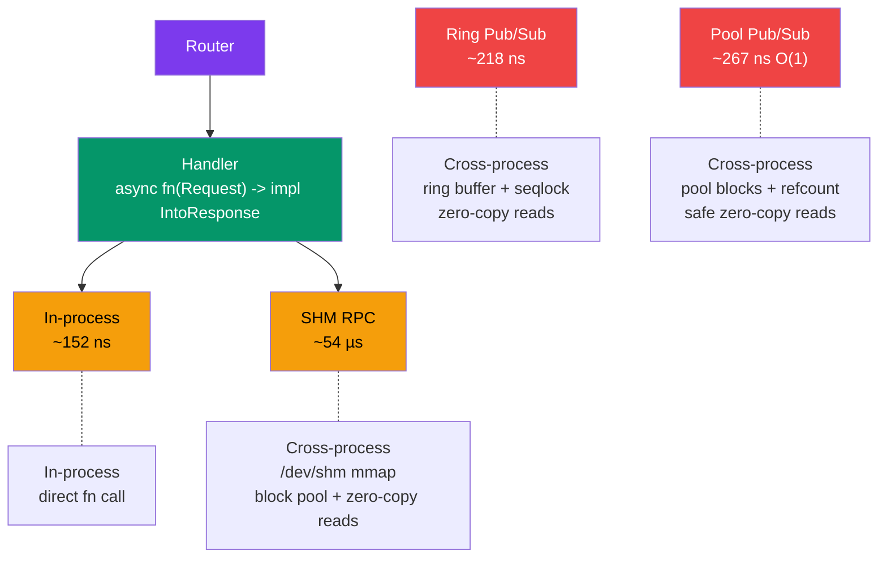

# crossbar

[](https://github.com/userFRM/crossbar/actions/workflows/ci.yml)
[](LICENSE-MIT)
[](https://www.rust-lang.org)

**Define handlers once. Serve over any transport.**

Crossbar is a transport-agnostic URI router for Rust. You write your request handlers once — then serve them over in-process or cross-process shared memory. Switch transports without changing a single line of handler code.

```rust
let router = Router::new()
    .route("/health", get(health))
    .route("/tick/:symbol", get(get_tick))
    .route("/echo", post(echo));

// Same router, same handlers — pick your transport.
InProcessClient::new(router.clone());                      // in-process,   ~150 ns
ShmServer::spawn("myapp", router.clone()).await?;          // cross-process, ~54 µs
```

---

## What is crossbar?

Most web frameworks (axum, actix, warp) couple your handlers to HTTP. Crossbar doesn't. It gives you a lightweight router where the **transport is just a deployment decision** — not a code decision.

**In plain terms:** imagine you have a function that returns stock prices. With crossbar, that same function can serve requests from:

- Another function in the same program (152 nanoseconds)
- Another process on the same machine via shared memory (54 µs RPC, 218 ns ring pub/sub, **67 ns pool pub/sub** — O(1), 1.5× faster than iceoryx2)

You never change the function. You only change how it's wired up.

> [!NOTE]
> Crossbar is **not** an HTTP framework. It uses a compact binary protocol
> instead of HTTP. If you need HTTP, use [axum](https://github.com/tokio-rs/axum). Crossbar
> targets workloads where HTTP overhead matters: trading systems, game servers, IPC sidecars,
> and real-time pipelines.

---

## Showcase: demo

Run the demo to see both transports in action with a latency comparison:

```sh
cargo run --example demo --features shm
```

The demo builds a single router and exercises it over both in-process and SHM transports, printing per-transport latency statistics (min, avg, p99, max).

---

## When to use crossbar (and when not to)

### Use crossbar when

- **You need IPC with URI routing** — crossbar gives you REST-like patterns (`/tick/:symbol`) without HTTP overhead
- **You're building a trading system** — sub-microsecond in-process dispatch, with cross-process SHM for co-located services
- **You have co-located services** — game servers, microservice sidecars, or ML pipelines on the same host
- **You want transport-agnostic testing** — swap SHM for `InProcessClient` and run integration tests without shared memory setup
- **You need pub/sub over shared memory** — 218 ns ring (45 ns silent), 67 ns pool (O(1) any payload size, 1.5× faster than iceoryx2)

### Don't use crossbar when

- **You need HTTP** — use [axum](https://github.com/tokio-rs/axum) or [actix-web](https://github.com/actix/actix-web)
- **You need browser compatibility** — crossbar's wire protocol is not HTTP
- **You want a mature ecosystem** — crossbar is new; axum has middleware, extractors, and a large community

> [!TIP]
> The crossbar roadmap includes an **HTTP bridge** that will let you serve crossbar routes
> over hyper/axum. This will give you the best of both worlds: crossbar for internal IPC,
> HTTP for external traffic, same handlers.

---

## How each transport works

Every transport follows the same pattern: the **client** sends a `Request`, the **router** dispatches it to a handler, and the **server** returns a `Response`. The difference is how the bytes travel between client and server.

### In-process — direct function call

```
Client                   Server
  │                        │
  ├── router.dispatch(req) ┤  (direct call, same thread)
  │                        │
  ◄── Response ────────────┘
```

The simplest transport. `InProcessClient` holds an `Arc<Router>` and calls `router.dispatch(req)` directly — the same way you'd call any async function. There is no serialization, no framing, no I/O. The request and response stay in the same memory space and the same thread.

**Cost:** one async function call (~152 ns).

**Use case:** in-process dispatch, unit testing, embedding crossbar as a function router.

### SHM RPC — shared memory with block pool and zero-copy reads (V2)

```
Client process                      Server process
  │                                     │
  ├── alloc request block (CAS)         │
  ├── memcpy request into block         │
  ├── acquire slot, set REQUEST_READY   │
  │                                     ├── poll: sees REQUEST_READY
  │                                     ├── state = PROCESSING
  │                                     ├── read request (zero-copy via Body::Mmap)
  │                                     ├── router.dispatch(req)
  │                                     ├── alloc response block
  │                                     ├── memcpy response into block
  │                                     ├── state = RESPONSE_READY
  ├── poll: sees RESPONSE_READY ◄───────┤
  ├── read response (zero-copy via Body::Mmap)
  ├── state = FREE                      │
  │                                     │
```

Both processes `mmap` the same file at `/dev/shm/crossbar-{name}`. The V2 architecture separates **coordination slots** (64 bytes each, hold state machine) from **data blocks** (configurable size, hold request/response payloads). Blocks are managed by a lock-free Treiber stack allocator.

Key V2 features:
- **Zero-copy reads:** Response bodies are returned as `Body::Mmap`, pointing directly into the mmap region. No memcpy on the read path. No external crate dependency (no `bytes`).
- **Block pool:** Data blocks are allocated independently from coordination slots via a lock-free Treiber stack with ABA protection.
- **Decoupled sizing:** Coordination slots are small and fixed; data block size is configurable independently.
- **SHM soundness:** All shared memory access uses raw pointers (`ptr::copy_nonoverlapping`) — no `&[u8]` references to raced memory. Mmap wrappers expose `as_ptr()`/`as_mut_ptr()` only, not `Deref`.

Synchronization uses a spin-then-futex strategy: spin briefly, then fall back to `futex_wait` (Linux) or polling (macOS) to avoid burning CPU while idle.

**Cost:** ~54 µs per round-trip (dominated by coordination overhead — `spawn_blocking`, futex transitions, header serialization — not by data copying).

**Use case:** cross-process request/response IPC on the same host.

### SHM Pub/Sub — zero-copy streaming

Crossbar offers two pub/sub modes: **ring-based** (lowest latency for small payloads) and **pool-based** (O(1) transfer for any payload size).

#### Ring Pub/Sub (`ShmPublisher`)

```
Publisher                   Shared Memory                  Subscriber
  │                                                           │
  ├── loan_to(&topic) ───► get mutable ptr to ring slot       │
  ├── write directly ────► data born in SHM (no copy)         │
  ├── publish() ─────────► atomic seq + futex_wake            │
  │                                                           │
  │                        ◄── try_recv_ref() ────────────────┤
  │                        ◄── returns raw ptr into mmap ─────┤
  │                        ◄── O(1) — no copy, no alloc ──────┤
```

A ring buffer with seqlock validation. Publisher writes raw bytes into mmap; subscriber reads in-place. Best for small payloads where O(n) write cost is negligible.

| Metric | Value |
|--------|-------|
| End-to-end latency (with futex wake) | **218 ns** |
| Transport-only (no futex, `publish_silent`) | **45 ns** |
| Throughput (64 KB payloads) | **17.5 GiB/s** |

#### Pool Pub/Sub (`ShmPoolPublisher`) — O(1) transfer

```
Publisher                   Shared Memory                  Subscriber
  │                                                           │
  ├── alloc pool block ──► Treiber stack CAS (O(1))           │
  ├── write into block ──► as_mut_slice() — born in SHM       │
  ├── publish() ─────────► write block index (8B) + refcount  │
  │                                                           │
  │                        ◄── try_recv() ────────────────────┤
  │                        ◄── CAS refcount (O(1)) ───────────┤
  │                        ◄── Deref into mmap — safe (O(1)) ─┤
  │                        ◄── guard dropped → block freed ───┤
```

iceoryx2-style ownership transfer. Publisher writes data into a pool block, then transfers only the block index (~8 bytes). Subscriber holds the block alive via atomic refcounting and reads directly from mmap — **safe `Deref<Target=[u8]>`, no `unsafe` needed**.

| Metric | Value |
|--------|-------|
| Latency (any payload, smart wake) | **67 ns** — O(1), 1.5× faster than iceoryx2 |
| Latency (any payload, silent) | **65 ns** — O(1), pure atomics floor |
| Throughput (64 KB payloads) | **45.6 GiB/s** |
| Throughput (1 MB payloads) | **29.7 GiB/s** |

> [!TIP]
> Use **ring pub/sub** when payload is small (<1 KB) and you want absolute lowest latency (45 ns silent).
> Use **pool pub/sub** when payloads are large or variable-sized — latency is constant regardless of size.
> Smart wake makes `publish()` nearly as fast as `publish_silent()` when subscribers use `try_recv()`.

---

## How crossbar compares

### vs axum / actix-web

Crossbar and HTTP frameworks solve different problems. Crossbar provides URI routing without HTTP — no headers, no content negotiation, no middleware ecosystem. If your service talks to browsers or external clients, use axum. If your services talk to each other on the same host, crossbar removes HTTP overhead while keeping the same routing patterns.

### vs iceoryx2

[iceoryx2](https://github.com/eclipse-iceoryx/iceoryx2) is a true zero-copy shared memory middleware. The architectural difference:

| | crossbar SHM | iceoryx2 |
|---|---|---|
| **RPC latency** | ~54 µs (V2, block pool) | N/A (pub/sub only) |
| **Pub/sub latency (small, ring)** | **45 ns** (no futex) | ~100 ns |
| **Pub/sub latency (any size, pool)** | **67 ns** — O(1) | ~100 ns — O(1) |
| **What is transferred (pool)** | Block index (~8 bytes) | Pointer offset (~8 bytes) |
| **Data model** | Ring buffer (loss-tolerant) + pool (refcounted) | Pool-based ownership transfer |
| **Pattern** | Request/response + pub/sub | Pub/sub + request/response |
| **Routing** | Built-in URI pattern matching | Service-oriented discovery |
| **Subscriber safety** | Ring: raw pointers. Pool: **safe `Deref`** (refcounted) | `unsafe` under the hood, safe API |

**Crossbar wins across the board:** 45 ns ring for small payloads, **67 ns pool for any size** — both faster than iceoryx2's ~100 ns. Crossbar's pool subscriber API is fully safe (`Deref<Target=[u8]>` backed by atomic refcounting). Smart wake eliminates the futex syscall when subscribers poll with `try_recv()`, cutting ~170 ns of kernel overhead.

### vs raw Unix IPC (pipes, message queues, domain sockets)

Crossbar adds URI-based routing on top of shared memory. Without crossbar, you'd need to implement your own message framing, request dispatching, and serialization. Crossbar gives you `router.route("/tick/:symbol", get(handler))` semantics over any transport.

---

## Architecture



---

## Transport comparison

| Transport | Typical latency | Boundary | Data path | Platform |
|---|---|---|---|---|
| **In-process** | ~152 ns | Same thread | Direct `Arc<Router>` call | All |
| **SHM RPC** | ~54 µs | Cross-process | `mmap` + block pool + atomics + futex | Unix (`shm` feature) |
| **SHM Ring Pub/Sub** | ~218 ns | Cross-process | `mmap` + ring buffer + seqlock + futex | Unix (`shm` feature) |
| **SHM Pool Pub/Sub** | ~67 ns (O(1)) | Cross-process | `mmap` + pool blocks + refcount + smart wake | Unix (`shm` feature) |

> [!IMPORTANT]
> These latency numbers are from Criterion benchmarks (see [BENCHMARKS.md](BENCHMARKS.md)).
> They will vary on your hardware. Run `cargo bench --features shm` to see your own numbers.

---

## Getting started

### 1. Add the dependency

```toml
[dependencies]
crossbar = "0.1"
tokio = { version = "1", features = ["rt-multi-thread", "macros"] }
```

For shared memory transport (Unix only):

```toml
crossbar = { version = "0.1", features = ["shm"] }
```

### 2. Define your handlers

Handlers are async functions returning anything that implements `IntoResponse`:

```rust
use crossbar::prelude::*;

async fn health() -> &'static str { "ok" }

async fn greet(req: Request) -> String {
    let name = req.path_param("name").unwrap_or("world");
    format!("Hello, {name}!")
}

async fn create_order(req: Request) -> Result<Json<Order>, (u16, &'static str)> {
    let input: OrderInput = req.json_body()
        .map_err(|_| (400u16, "invalid JSON"))?;
    Ok(Json(process(input)))
}
```

### 3. Build the router

```rust
let router = Router::new()
    .route("/health", get(health))
    .route("/greet/:name", get(greet))
    .route("/order", post(create_order));
```

### 4. Serve over any transport

```rust
// In-process (testing, embedded)
let client = InProcessClient::new(router.clone());
let resp = client.get("/health").await;

// Shared memory (cross-process, same host)
ShmServer::bind("myapp", router).await?;
// In another process:
let client = ShmClient::connect("myapp").await?;
let resp = client.get("/health").await?;
```

> [!TIP]
> Use `InProcessClient` in your test suite. It has zero overhead and doesn't need
> shared memory setup, so your tests run faster and never flake on CI.

---

## Handler system

Crossbar supports async handlers, sync wrappers, a `#[handler]` proc macro, and a rich `IntoResponse` trait.

### Async handlers

```rust
async fn health() -> &'static str { "ok" }                // zero args
async fn echo(req: Request) -> String { req.body_str() }   // receives Request
```

### Sync handlers

```rust
use crossbar::prelude::*;

let router = Router::new()
    .route("/health", get(sync_handler(|| "ok")))
    .route("/echo", post(sync_handler_with_req(|req: Request| {
        format!("got {} bytes", req.body.len())
    })));
```

### `#[handler]` proc macro

Extract path params, query params, and JSON bodies automatically:

```rust
use crossbar_macros::handler;

#[handler]
async fn get_tick(
    #[path("symbol")] symbol: String,
    #[query("venue")] venue: Option<String>,
    #[body] filters: Filters,
) -> Json<TickData> {
    // symbol, venue, filters extracted automatically
    // missing required params return 400
}
```

| Attribute | Type | On missing |
|---|---|---|
| `#[path("name")]` | `String` / `Option<String>` | 400 / `None` |
| `#[query("name")]` | `String` / `Option<String>` | 400 / `None` |
| `#[body]` | `T: Deserialize` | 400 |
| *(none)* | `Request` | passthrough |

### `IntoResponse` types

| Return type | Status | Body |
|---|---|---|
| `&'static str` | 200 | text |
| `String` | 200 | text |
| `Vec<u8>` / `Body` | 200 | raw bytes |
| `Json<T: Serialize>` | 200 | JSON |
| `(u16, &str)` / `(u16, String)` | custom | text |
| `Result<R, E>` | delegates | delegates |
| `Response` | passthrough | passthrough |

---

## Shared memory transport

The `shm` feature adds `ShmServer` and `ShmClient` for cross-process RPC via shared memory, `ShmPublisher` and `ShmSubscriber` for ring-based pub/sub, and `ShmPoolPublisher` and `ShmPoolSubscriber` for O(1) pool-based pub/sub.

```toml
crossbar = { version = "0.1", features = ["shm"] }
```

### Request/Response (SHM RPC)

```rust
// Process A — server
let router = Router::new().route("/tick", get(get_tick));
ShmServer::bind("myapp", router).await?;

// Process B — client
let client = ShmClient::connect("myapp").await?;
let resp = client.get("/tick").await?;
```

**How it works:** The server creates a memory-mapped region at `/dev/shm/crossbar-{name}` using direct `libc::mmap` with `MADV_HUGEPAGE` (transparent 2 MiB huge pages for TLB efficiency). The V2 architecture uses a block pool allocator (Treiber stack) for data blocks, with separate coordination slots for the request/response state machine. Reads are zero-copy via `Body::Mmap` — a custom guard that holds the mmap region alive and frees the block on drop. No external `bytes` crate dependency.

| Detail | Value |
|---|---|
| Coordination slots | 64 (configurable via `ShmConfig::slot_count`) |
| Block count | 192 (configurable via `ShmConfig::block_count`) |
| Block size | 64 KiB (configurable via `ShmConfig::block_size`) |
| Total region size | ~12.6 MiB (with defaults) |
| Synchronization | spin + futex_wait (Linux) / poll (macOS) |
| Crash recovery | Server heartbeat + stale slot CAS recovery |

> [!WARNING]
> The SHM transport is **Unix-only** (Linux and macOS). On Linux it uses futex for
> cross-process wake; on macOS it falls back to polling. SHM requires the `shm` feature flag.

> [!CAUTION]
> Payloads larger than the block size (default 64 KiB) will be rejected with
> `CrossbarError::ShmMessageTooLarge`. If you need larger payloads, increase block size
> via `ShmConfig`. If all blocks are in use, requests fail with `CrossbarError::ShmPoolExhausted`.

### Pub/Sub (zero-copy SHM)

#### Ring pub/sub (lowest latency for small payloads)

```rust
// Publisher process
let mut pub_ = ShmPublisher::create("prices", PubSubConfig::default())?;
let topic = pub_.register("/tick/AAPL")?;

// Born-in-SHM: write directly into the mmap slot
let mut loan = pub_.loan_to(&topic);
loan.as_mut_slice()[..8].copy_from_slice(&42u64.to_le_bytes());
loan.set_len(8);
loan.publish();  // 218 ns end-to-end

// Subscriber process
let sub = ShmSubscriber::connect("prices")?;
let mut stream = sub.subscribe("/tick/AAPL")?;

if let Some(sample) = stream.try_recv_ref() {
    let data = sample.copy_to_vec();  // safe: copies within seqlock window
}
```

#### Pool pub/sub (O(1) transfer, any payload size)

```rust
// Publisher process
let mut pub_ = ShmPoolPublisher::create("market", PoolPubSubConfig::default())?;
let topic = pub_.register_topic("prices/AAPL")?;

// Born-in-SHM: write directly into pool block
let mut loan = pub_.loan(&topic)?;
loan.as_mut_slice()[..8].copy_from_slice(&42u64.to_le_bytes());
loan.publish(8);  // 267 ns — transfers block index only, O(1)

// Subscriber process
let sub = ShmPoolSubscriber::connect("market")?;
let mut stream = sub.subscribe("prices/AAPL")?;

// Safe zero-copy read — Deref<Target=[u8]> into mmap, no unsafe needed
if let Some(guard) = stream.try_recv() {
    let data: &[u8] = &*guard;  // safe Deref, block held alive by refcount
    println!("got {} bytes", data.len());
}
// guard dropped → block freed back to pool
```

---

## Benchmarks

Criterion benchmarks for all transports. Full results, methodology, and throughput data
in [BENCHMARKS.md](BENCHMARKS.md).

### Request/Response latency

| Benchmark | In-process | SHM (V2) |
|---|---|---|
| `/health` (2B response) | 152 ns | 53.5 µs |
| JSON + path params (OHLC) | 1.14 µs | 55.7 µs |
| POST JSON body | 1.34 µs | 56.5 µs |
| 64 KB response | 1.19 µs | 55.8 µs |
| 1 MB response | 16.97 µs | 72.7 µs |

### Pub/Sub latency

| Mode | Latency |
|---|---|
| Ring: `publish()` + `try_recv_ref()` (with futex wake) | **218 ns** |
| Ring: `publish_silent()` + `try_recv_ref()` (no futex) | **45 ns** |
| Pool: `publish()` + `try_recv()` (smart wake) — O(1) any payload | **67 ns** |
| Pool: `publish_silent()` + `try_recv()` — O(1) any payload | **65 ns** |

### Throughput

| Transport | 64 KB | 1 MB |
|---|---|---|
| In-process | 53.2 GiB/s | 54.7 GiB/s |
| SHM RPC | 1.09 GiB/s | 13.6 GiB/s |
| Ring Pub/Sub | 17.5 GiB/s | 15.2 GiB/s |
| **Pool Pub/Sub (O(1))** | **45.6 GiB/s** | **29.7 GiB/s** |

> [!NOTE]
> Run `cargo bench --features shm` on your hardware — your numbers will differ.
> See [BENCHMARKS.md](BENCHMARKS.md) for methodology and detailed results.

---

## Project layout

```
crossbar/
  src/
    lib.rs              Crate root, prelude
    router.rs           URI pattern matching, route registration
    handler.rs          Handler trait, sync wrappers, BoxedHandler
    types.rs            Request, Response, Uri, Method, Body, IntoResponse, Json
    error.rs            CrossbarError enum
    transport/
      mod.rs            SHM serialization helpers
      inproc.rs         InProcessClient (direct dispatch)
      shm/
        mod.rs          ShmServer, ShmClient, ShmHandle
        mmap.rs         Raw libc::mmap wrappers (MAP_POPULATE, MADV_HUGEPAGE)
        region.rs       V2 memory-mapped region, block pool allocator
        notify.rs       Futex (Linux) / polling (macOS) wait/wake
        pubsub.rs       ShmPublisher, ShmSubscriber (ring-based pub/sub)
        pool_pubsub.rs  ShmPoolPublisher, ShmPoolSubscriber (O(1) pool pub/sub)
  crossbar-macros/      #[handler] and #[derive(IntoResponse)] proc macros
  examples/
    demo.rs             In-process + SHM latency comparison
    pubsub_publisher.rs SHM pub/sub publisher example
    pubsub_subscriber.rs SHM pub/sub subscriber example
  tests/
    transport.rs        37 transport tests (in-process + SHM + ring/pool pub/sub)
    stress.rs           11 stress/concurrency tests
    routing.rs          31 URI pattern matching tests
    handler.rs          28 handler trait tests
    macros.rs           13 proc macro tests
    types.rs            64 type/serialization tests
  benches/
    transport.rs        Criterion benchmarks (dispatch, inproc, shm, pubsub, throughput)
```

> **244 tests** across the workspace. Run with `cargo test --workspace --features shm`.

---

## Roadmap

- **Dedicated SHM poller** — eliminate `spawn_blocking` / `block_on` from RPC path, targeting sub-10 µs latency
- **HTTP bridge** — serve crossbar routes over hyper/axum for HTTP compatibility
- **Middleware** — composable request/response interceptors (logging, auth, metrics)
- **WebSocket transport** — persistent bidirectional communication

---

## Contributing

Contributions welcome. Run the test suite before submitting:

```sh
cargo fmt --all -- --check
cargo clippy --workspace --all-targets --features shm -- -D warnings
cargo test --workspace --features shm
```

---

## License

Licensed under either of

- **MIT License** ([LICENSE-MIT](LICENSE-MIT) or <http://opensource.org/licenses/MIT>)
- **Apache License, Version 2.0** ([LICENSE-APACHE](LICENSE-APACHE) or <http://www.apache.org/licenses/LICENSE-2.0>)

at your option.
