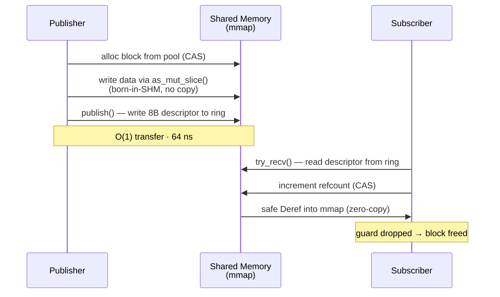
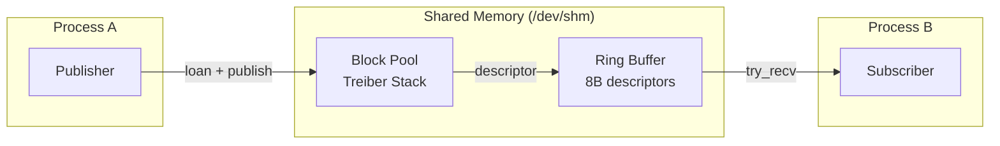

# crossbar

[](https://github.com/userFRM/crossbar/actions/workflows/ci.yml)
[](LICENSE-MIT)
[](https://www.rust-lang.org)

**Zero-copy IPC for Rust with URI-addressed subscriptions.** Pub/sub over shared memory with O(1) transport and URI routing for in-process dispatch.

> [!NOTE]
> Crossbar is **not** an HTTP server. It moves data between processes on the same
> machine via shared memory (`/dev/shm`). Think of it as URI-addressed pub/sub
> channels backed by a lock-free block pool. If you need HTTP, use
> [axum](https://github.com/tokio-rs/axum).

---

## Performance


**Left:** O(1) transport proof — we write a fixed 8 bytes into backing buffers from 64 B to 1 MB. Latency is flat for both frameworks. The transfer (writing an 8-byte descriptor to a ring) is always O(1). Crossbar is **3.7x faster** (64 ns vs 237 ns).

**Right:** End-to-end with full payload — both write the entire payload into SHM before transfer. At small sizes, crossbar's lower overhead wins. At 64 KB+, both converge to the same speed because `memcpy` dominates.

Both benchmarks use the same operations: `loan buffer` -> `write data` -> `publish` -> `receive` -> `deref`. Apples-to-apples, same process, same Criterion harness.

> **Benchmark system:** Intel i7-10700KF @ 3.80 GHz, Linux 6.8, rustc stable.
> iceoryx2 claims ~100 ns on an i7-13700H — our 237 ns measurement reflects our
> older hardware. Run on yours: `cargo bench --features shm -- "head_to_head"`

---

## Quick start

### Pub/sub — two processes, one topic


```mermaid
sequenceDiagram
    participant P as Publisher
    participant SHM as Shared Memory<br/>(mmap)
    participant S as Subscriber

    P->>SHM: alloc block from pool (CAS)
    P->>SHM: write data via as_mut_slice()<br/>(born-in-SHM, no copy)
    P->>SHM: publish() — write 8B descriptor to ring

    Note over P,SHM: O(1) transfer · 64 ns

    S->>SHM: try_recv() — read descriptor from ring
    S->>SHM: increment refcount (CAS)
    SHM->>S: safe Deref into mmap (zero-copy)

    Note over S: guard dropped → block freed
```

**Publisher** writes price data directly into shared memory:

```rust
// publisher.rs
use crossbar::prelude::*;

fn main() -> Result<(), Box<dyn std::error::Error>> {
    let mut pub_ = ShmPublisher::create("market", PubSubConfig::default())?;
    let topic = pub_.register("prices/AAPL")?;

    loop {
        let price: f64 = get_price(); // your data source

        let mut loan = pub_.loan(&topic);                        // alloc block from pool
        loan.as_mut_slice()[..8].copy_from_slice(&price.to_le_bytes()); // write into SHM
        loan.set_len(8);
        loan.publish();                                          // transfer ownership — O(1)
    }
}
```

**Subscriber** reads the data in-place — zero copies, no `unsafe`:

```rust
// subscriber.rs
use crossbar::prelude::*;

fn main() -> Result<(), Box<dyn std::error::Error>> {
    let sub = ShmSubscriber::connect("market")?;
    let mut stream = sub.subscribe("prices/AAPL")?;

    loop {
        if let Some(guard) = stream.try_recv() {
            let data: &[u8] = &guard;  // safe Deref — reads directly from mmap
            let price = f64::from_le_bytes(data[..8].try_into().unwrap());
            println!("AAPL: {price:.2}");
        }
        // guard dropped -> block freed back to pool
    }
}
```

Run both in separate terminals:

```sh
cargo run --example pubsub_publisher --features shm
cargo run --example pubsub_subscriber --features shm
```

### In-process routing (for testing and same-process dispatch)

```rust
use crossbar::prelude::*;

fn health() -> &'static str { "ok" }

fn echo(req: Request) -> Response {
    Response::ok().with_body(req.body.clone())
}

let router = Router::new()
    .route("/health", get(health))
    .route("/echo", post(echo));

let client = InProcessClient::new(router);
let resp = client.get("/health");  // ~143 ns
assert_eq!(resp.status, 200);
```

---

## How it works


```mermaid
graph LR
    subgraph "Process A"
        PUB["Publisher"]
    end

    subgraph "Shared Memory (/dev/shm)"
        POOL["Block Pool<br/>Treiber Stack"]
        RING["Ring Buffer<br/>8B descriptors"]
    end

    subgraph "Process B"
        SUB["Subscriber"]
    end

    PUB -->|"loan + publish"| POOL
    POOL -->|"descriptor"| RING
    RING -->|"try_recv"| SUB
```

Crossbar has two distinct fast paths:

1. **In-process dispatch** uses the URI router directly. There is no framing,
   no serialization, and no shared memory.
2. **Pub/sub** allocates a block from a lock-free pool, writes data into
   the mmap'd block, transfers ownership via an 8-byte descriptor, and exposes
   the payload through a safe zero-copy guard on the subscriber side.

The pool pub/sub transport is the part that maps most closely to
[iceoryx2](https://github.com/eclipse-iceoryx/iceoryx2). Both use ring buffers
for publication and shared-memory pools for block allocation. The difference is
what sits *above* that transport:

| | crossbar | iceoryx2 |
|---|---|---|
| **Transport** | **64 ns** | ~237 ns (our hw) / ~100 ns (theirs) |
| **Pool allocator** | Treiber stack (lock-free CAS) | Lock-free pool |
| **Above pub/sub** | URI/topic names + in-process router | Service discovery + POSIX config |
| **API style** | URI-addressed pub/sub + endpoint-style dispatch | Typed pub/sub channels |
| **`no_std`** | No | Yes |
| **Platforms** | Linux, macOS, Windows | Linux, macOS, Windows, QNX, ... |

Crossbar is faster because it skips iceoryx2's service discovery and POSIX configuration layer — it goes straight from user code to atomics.

---

## Handler system

### Sync handlers

```rust
fn health() -> &'static str { "ok" }
fn echo(req: Request) -> Vec<u8> { req.body.to_vec() }

let router = Router::new()
    .route("/health", get(health))
    .route("/echo", post(echo));
```

### `#[handler]` proc macro

```rust
use crossbar::handler;

#[handler]
fn get_tick(
    #[path("symbol")] symbol: String,
    #[query("venue")] venue: Option<String>,
) -> String {
    // symbol, venue extracted automatically
    // missing required params return 400
    format!("{symbol}@{}", venue.unwrap_or_default())
}
```

| Attribute | Type | On missing |
|---|---|---|
| `#[path("name")]` | `String` / `Option<String>` | 400 / `None` |
| `#[query("name")]` | `String` / `Option<String>` | 400 / `None` |
| *(none)* | `Request` | passthrough |

### Return types (`IntoResponse`)

| Return type | Status | Body |
|---|---|---|
| `&'static str` | 200 | text |
| `String` | 200 | text |
| `Vec<u8>` / `Body` | 200 | raw bytes |
| `(u16, &str)` / `(u16, String)` | custom | text |
| `Result<R, E>` | delegates | delegates |
| `Response` | passthrough | passthrough |

---

## Installation

```toml
[dependencies]
crossbar = { version = "0.1", features = ["shm"] }
```

The `shm` feature enables shared memory transport (Linux, macOS, Windows). Without it, only `InProcessClient` is available.

---

## Configuration

### Pub/Sub (`PubSubConfig`)

| Field | Default | Description |
|---|---|---|
| `max_topics` | 16 | Maximum concurrent topics |
| `block_count` | 256 | Pool blocks available |
| `block_size` | 64 KiB | Bytes per block (usable: block_size - 8) |
| `ring_depth` | 8 | Samples before overwrite |
| `heartbeat_interval` | 100 ms | Publisher liveness signal |
| `stale_timeout` | 5 s | Publisher considered dead after this |

---

## Benchmarks

### Pub/Sub latency

| Mode | Latency |
|---|---|
| `publish()` + `try_recv()` (smart wake) | **67 ns** |
| `publish_silent()` + `try_recv()` | **65 ns** |

### Pub/Sub throughput

| Payload | Throughput |
|---|---|
| 64 KB | **45.6 GiB/s** |
| 1 MB | **29.7 GiB/s** |

### In-process dispatch

| Benchmark | Latency |
|---|---|
| `/health` (2B) | **143 ns** |
| OHLC (JSON + path params) | 937 ns |
| POST JSON body | 1.26 us |

---

## Project layout

```
crossbar/
  src/
    lib.rs              Crate root, prelude
    router.rs           URI pattern matching, route registration
    handler.rs          Handler trait, BoxedHandler
    types.rs            Request, Response, Uri, Method, Body, IntoResponse
    error.rs            CrossbarError enum
    transport/
      mod.rs            Transport module
      inproc.rs         InProcessClient (direct dispatch)
      shm/
        mod.rs          SHM module root
        mmap.rs         Raw mmap wrappers (MADV_HUGEPAGE)
        notify.rs       Futex (Linux) / polling (macOS) wait/wake
        pubsub.rs       ShmPublisher, ShmSubscriber (O(1) pub/sub)
  crossbar-macros/      #[handler] proc macro
  examples/
    demo.rs             In-process latency demo
    pubsub_publisher.rs Cross-process pub/sub publisher
    pubsub_subscriber.rs Cross-process pub/sub subscriber
  tests/                Integration and stress tests
  benches/
    transport.rs        Criterion benchmarks (including iceoryx2 head-to-head)
```

---

## Contributing

```sh
cargo fmt --all -- --check
cargo clippy --workspace --all-targets --features shm -- -D warnings
cargo test --workspace --features shm
```

---

## License

Licensed under either of

- **MIT License** ([LICENSE-MIT](LICENSE-MIT) or <http://opensource.org/licenses/MIT>)
- **Apache License, Version 2.0** ([LICENSE-APACHE](LICENSE-APACHE) or <http://www.apache.org/licenses/LICENSE-2.0>)

at your option.
