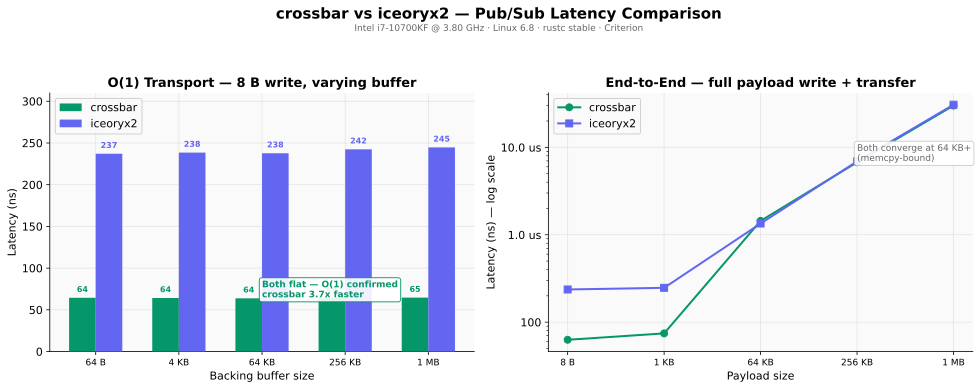
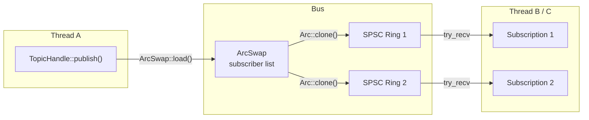
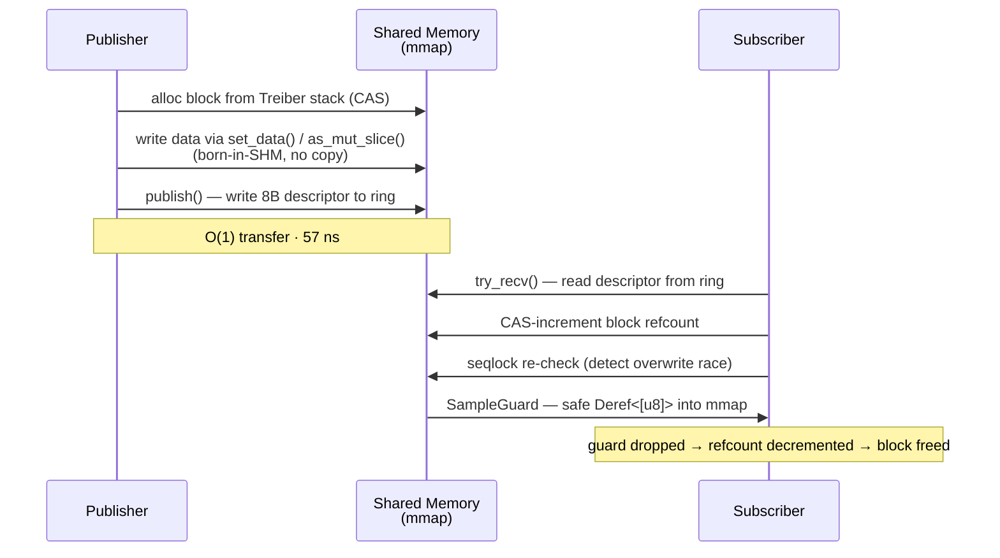
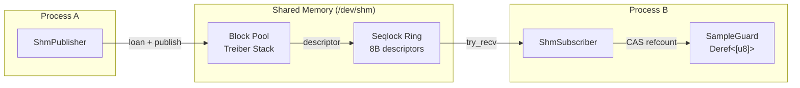

# crossbar

[](https://github.com/userFRM/crossbar/actions/workflows/ci.yml)
[](LICENSE-MIT)
[](https://www.rust-lang.org)

**URI-addressed pub/sub for local communication. In-process fan-out and zero-copy shared-memory transport.**

> [!NOTE]
> Crossbar is **not** an HTTP server. It moves data between threads via `Arc<T>`
> (in-process) or between processes via shared memory (`/dev/shm`). Think
> URI-addressed channels at hardware speed. If you need HTTP, use
> [axum](https://github.com/tokio-rs/axum).

---

## Two crates

Crossbar is a workspace with two independent crates. Use one or both.

### `crossbar-inproc` — in-process pub/sub

Type-safe `Bus<T>` for fan-out within a single process. Messages are shared via
`Arc<T>` — zero serialization, zero copies. Named topics like `"prices/AAPL"`.
The publish hot path is lock-free: `ArcSwap::load()` reads the subscriber list,
then each subscriber's SPSC ring receives an `Arc::clone()` of the message.

### `crossbar-ipc` — shared-memory pub/sub

Zero-copy pub/sub over `/dev/shm`. Allocates blocks from a lock-free Treiber
stack pool, writes data directly into the mmap'd region, and transfers ownership
via an 8-byte descriptor. O(1) transport regardless of payload size. Subscribers
get safe `SampleGuard` references with `Deref<Target=[u8]>` — the block is held
alive by atomic refcounting via a seqlock ring.

---

## Performance



**Left:** O(1) transport proof — we write a fixed 8 bytes into backing buffers from 64 B to 1 MB. Latency is flat for both frameworks. The transfer (writing an 8-byte descriptor to a ring) is always O(1). Crossbar is **4.1x faster** (57 ns vs 231 ns).

**Right:** End-to-end with full payload — both write the entire payload into SHM before transfer. At small sizes, crossbar's lower overhead wins. At 64 KB+, both converge to the same speed because `memcpy` dominates.

Both benchmarks use the same operations: `loan buffer` -> `write data` -> `publish` -> `receive` -> `deref`. Apples-to-apples, same process, same Criterion harness.

> **Benchmark system:** Intel i7-10700KF @ 3.80 GHz, Linux 6.8, rustc stable.
> iceoryx2 claims ~100 ns on an i7-13700H — our 237 ns measurement reflects our
> older hardware. Run on yours: `cargo bench -p crossbar-ipc -- "head_to_head"`

| | crossbar | iceoryx2 |
|---|---|---|
| **Transport** | **57 ns** | ~231 ns (our hw) / ~100 ns (theirs) |
| **Pool allocator** | Treiber stack (lock-free CAS) | Lock-free pool |
| **Above pub/sub** | URI/topic names + in-process bus | Service discovery + POSIX config |
| **API style** | URI-addressed pub/sub | Typed pub/sub channels |
| **`no_std`** | No | Yes |
| **Platforms** | Linux, macOS, Windows | Linux, macOS, Windows, QNX, ... |

Crossbar is faster because it skips iceoryx2's service discovery and POSIX configuration layer — it goes straight from user code to atomics.

---

## Quick start

### In-process pub/sub

```rust
use crossbar_inproc::prelude::*;
use std::sync::Arc;

let bus = Bus::<String>::new();
let topic = bus.topic("prices/AAPL");
let sub = bus.subscribe("prices/AAPL");

topic.publish(Arc::new("42.50".into()));
let msg = sub.try_recv().unwrap();
println!("AAPL: {msg}");
```

### Cross-process pub/sub

**Publisher** writes data directly into shared memory:

```rust
use crossbar_ipc::*;

let mut pub_ = ShmPublisher::create("market", PubSubConfig::default())?;
let topic = pub_.register("/prices/AAPL")?;

let mut loan = pub_.loan(&topic);
loan.set_data(b"42.50");
loan.publish(); // O(1) — writes 8 bytes to ring
```

**Subscriber** reads the data in-place — zero copies, no `unsafe`:

```rust
use crossbar_ipc::*;

let sub = ShmSubscriber::connect("market")?;
let stream = sub.subscribe("/prices/AAPL")?;

if let Some(guard) = stream.try_recv() {
    println!("AAPL: {}", std::str::from_utf8(&guard).unwrap());
}
// guard dropped -> block freed back to pool
```

Run both in separate terminals:

```sh
cargo run -p crossbar-ipc --example publisher
cargo run -p crossbar-ipc --example subscriber
```

---

## How it works

Crossbar has two distinct fast paths. They solve different problems and have
different hot-path costs.

### In-process path (`crossbar-inproc`)


```mermaid
graph LR
    subgraph "Thread A"
        PUB["TopicHandle::publish()"]
    end

    subgraph "Bus<T>"
        AS["ArcSwap<br/>subscriber list"]
        R1["SPSC Ring 1"]
        R2["SPSC Ring 2"]
    end

    subgraph "Thread B / C"
        S1["Subscription 1"]
        S2["Subscription 2"]
    end

    PUB -->|"ArcSwap::load()"| AS
    AS -->|"Arc::clone()"| R1
    AS -->|"Arc::clone()"| R2
    R1 -->|"try_recv"| S1
    R2 -->|"try_recv"| S2
```

1. `TopicHandle::publish()` loads the subscriber list via `ArcSwap` (lock-free)
2. Each subscriber's dedicated SPSC ring receives an `Arc::clone()` of the message
3. On overflow, the ring CAS-advances its tail to drop the oldest message (lossy)
4. `Subscription::recv()` uses a 3-phase wait: spin (32) -> yield (32) -> condvar

### Shared-memory path (`crossbar-ipc`)


```mermaid
sequenceDiagram
    participant P as Publisher
    participant SHM as Shared Memory<br/>(mmap)
    participant S as Subscriber

    P->>SHM: alloc block from Treiber stack (CAS)
    P->>SHM: write data via set_data() / as_mut_slice()<br/>(born-in-SHM, no copy)
    P->>SHM: publish() — write 8B descriptor to ring

    Note over P,SHM: O(1) transfer · 57 ns

    S->>SHM: try_recv() — read descriptor from ring
    S->>SHM: CAS-increment block refcount
    S->>SHM: seqlock re-check (detect overwrite race)
    SHM->>S: SampleGuard — safe Deref<[u8]> into mmap

    Note over S: guard dropped → refcount decremented → block freed
```


```mermaid
graph LR
    subgraph "Process A"
        PUB["ShmPublisher"]
    end

    subgraph "Shared Memory (/dev/shm)"
        POOL["Block Pool<br/>Treiber Stack"]
        RING["Seqlock Ring<br/>8B descriptors"]
    end

    subgraph "Process B"
        SUB["ShmSubscriber"]
        GUARD["SampleGuard<br/>Deref<[u8]>"]
    end

    PUB -->|"loan + publish"| POOL
    POOL -->|"descriptor"| RING
    RING -->|"try_recv"| SUB
    SUB -->|"CAS refcount"| GUARD
```

---

## Installation

```toml
# In-process pub/sub only
[dependencies]
crossbar-inproc = "0.2"

# Shared-memory pub/sub
[dependencies]
crossbar-ipc = "0.1"
```

---

## Configuration

### In-process (`BusConfig`)

| Field | Default | Description |
|---|---|---|
| `ring_depth` | 64 | Default ring depth for new subscribers |

### Shared-memory (`PubSubConfig`)

| Field | Default | Description |
|---|---|---|
| `max_topics` | 16 | Maximum concurrent topics |
| `block_count` | 256 | Pool blocks available |
| `block_size` | 64 KiB | Bytes per block (usable: block_size - 8) |
| `ring_depth` | 8 | Samples before overwrite |
| `heartbeat_interval` | 100 ms | Publisher liveness signal |
| `stale_timeout` | 5 s | Publisher considered dead after this |

---

## Benchmarks

### Shared-memory pub/sub latency

| Mode | Latency |
|---|---|
| `publish()` + `try_recv()` (smart wake) | **58 ns** |
| `publish_silent()` + `try_recv()` | **59 ns** |

### Shared-memory pub/sub throughput

| Payload | Throughput |
|---|---|
| 64 KB | **46.7 GiB/s** |
| 1 MB | **31.4 GiB/s** |

### In-process pub/sub

| Benchmark | Latency |
|---|---|
| 1-subscriber roundtrip (publish + try_recv) | **57 ns** |
| Fan-out to 10 subscribers | **224 ns** |
| try_recv (empty) | **1 ns** |

---

## Project layout

```
crossbar/
  crossbar-inproc/         In-process pub/sub (v0.2.0)
    src/
      lib.rs               Bus<T>, prelude
      bus.rs               Central registry, topic creation, BusConfig
      ring.rs              Lock-free SPSC ring buffer (CAS overflow)
      topic.rs             TopicHandle, lock-free publish via ArcSwap
      subscription.rs      Subscription, 3-phase recv (spin/yield/condvar)
    benches/bus.rs         Criterion benchmarks
    examples/demo.rs       Market data fan-out demo
  crossbar-ipc/            Shared-memory pub/sub (v0.1.0)
    src/
      lib.rs               Crate root, re-exports
      pubsub.rs            ShmPublisher, ShmSubscriber, SampleGuard
      mmap.rs              Raw mmap wrappers (MADV_HUGEPAGE)
      notify.rs            Futex (Linux) / WaitOnAddress (Windows) / polling (macOS)
      error.rs             IpcError enum
    benches/pubsub.rs      Criterion benchmarks (incl. iceoryx2 head-to-head)
    examples/
      publisher.rs         Cross-process latency benchmark (publisher)
      subscriber.rs        Cross-process latency benchmark (subscriber)
```

---

## Contributing

```sh
cargo fmt --all -- --check
cargo clippy --workspace --all-targets -- -D warnings
cargo test --workspace
```

---

## License

Licensed under either of

- **MIT License** ([LICENSE-MIT](LICENSE-MIT) or <http://opensource.org/licenses/MIT>)
- **Apache License, Version 2.0** ([LICENSE-APACHE](LICENSE-APACHE) or <http://www.apache.org/licenses/LICENSE-2.0>)

at your option.
