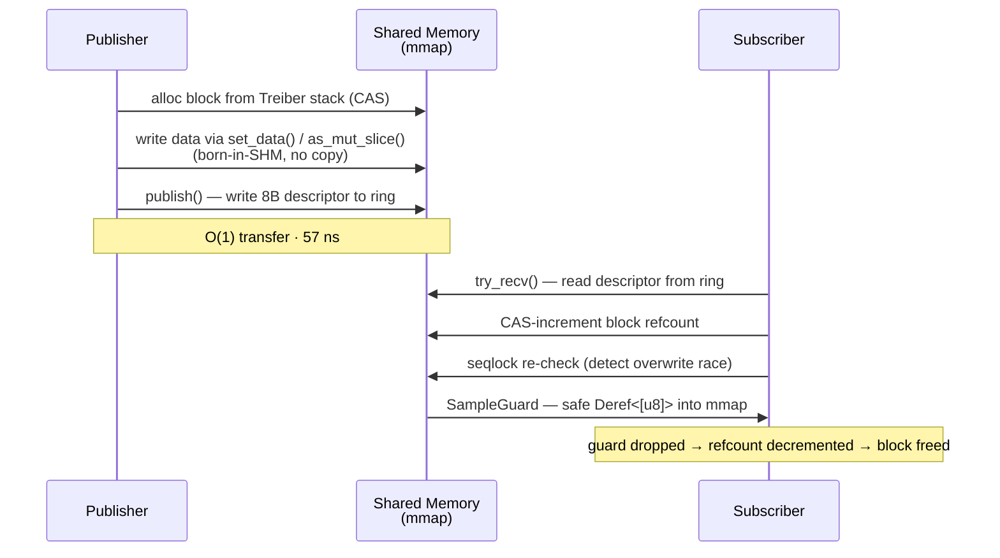
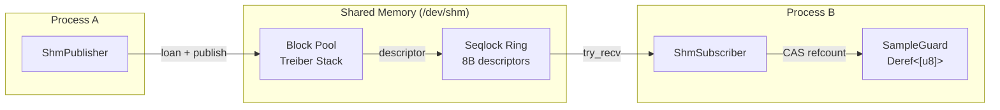

# crossbar

[](https://github.com/userFRM/crossbar/actions/workflows/ci.yml)
[](LICENSE-MIT)
[](https://www.rust-lang.org)

**Fastest zero-copy IPC. Typed pub/sub over shared memory. 58 ns transport, 4.1x faster than iceoryx2.**

> [!NOTE]
> Crossbar is **not** an HTTP server. It moves data between processes via shared
> memory (`/dev/shm`). Think URI-addressed channels at hardware speed. If you
> need HTTP, use [axum](https://github.com/tokio-rs/axum).

---

## What is crossbar?

Crossbar is a single Rust crate for zero-copy pub/sub over shared memory.
Allocates blocks from a lock-free Treiber stack pool, writes data directly into
the mmap'd region, and transfers ownership via an 8-byte descriptor. O(1)
transport regardless of payload size. Subscribers get safe `SampleGuard`
references with `Deref<Target=[u8]>` -- the block is held alive by atomic
refcounting via a seqlock ring.

### Features

- **O(1) transport** -- publishes an 8-byte descriptor; latency is constant regardless of payload size
- **Zero-copy reads** -- subscribers deref directly into the mmap'd shared memory region
- **Lock-free pool** -- Treiber stack allocation with ABA-safe generation counters
- **URI-addressed topics** -- subscribe to `"/prices/AAPL"` by name, no compile-time wiring
- **Typed pub/sub** -- `Pod` trait for safe zero-copy reads of structured types via `register_typed` / `loan_typed` / `try_recv_typed`
- **Smart wake** -- futex-based notification that skips the syscall when no subscribers are waiting
- **Cross-platform** -- Linux, macOS, Windows

---

## Performance


**Left:** O(1) transport proof -- we write a fixed 8 bytes into backing buffers from 64 B to 1 MB. Latency is flat for both frameworks. The transfer (writing an 8-byte descriptor to a ring) is always O(1). Crossbar is **4.1x faster** (57 ns vs 231 ns).

**Right:** End-to-end with full payload -- both write the entire payload into SHM before transfer. At small sizes, crossbar's lower overhead wins. At 64 KB+, both converge to the same speed because `memcpy` dominates.

Both benchmarks use the same operations: `loan buffer` -> `write data` -> `publish` -> `receive` -> `deref`. Apples-to-apples, same process, same Criterion harness.

> **Benchmark system:** Intel i7-10700KF @ 3.80 GHz, Linux 6.8, rustc stable.
> iceoryx2 claims ~100 ns on an i7-13700H -- our 237 ns measurement reflects our
> older hardware. Run on yours: `cargo bench -- "head_to_head"`

| | crossbar | iceoryx2 |
|---|---|---|
| **Transport** | **57 ns** | ~231 ns (our hw) / ~100 ns (theirs) |
| **Pool allocator** | Treiber stack (lock-free CAS) | Lock-free pool |
| **Above pub/sub** | URI/topic names | Service discovery + POSIX config |
| **API style** | URI-addressed pub/sub + typed pub/sub | Typed pub/sub channels |
| **`no_std`** | No | Yes |
| **Platforms** | Linux, macOS, Windows | Linux, macOS, Windows, QNX, ... |

Crossbar is faster because it skips iceoryx2's service discovery and POSIX configuration layer -- it goes straight from user code to atomics.

---

## Quick start

### Byte-oriented pub/sub

**Publisher** writes data directly into shared memory:

```rust
use crossbar::*;

let mut pub_ = ShmPublisher::create("market", PubSubConfig::default())?;
let topic = pub_.register("/prices/AAPL")?;

let mut loan = pub_.loan(&topic);
loan.set_data(b"42.50");
loan.publish(); // O(1) -- writes 8 bytes to ring
```

**Subscriber** reads the data in-place -- zero copies, no `unsafe`:

```rust
use crossbar::*;

let sub = ShmSubscriber::connect("market")?;
let stream = sub.subscribe("/prices/AAPL")?;

if let Some(guard) = stream.try_recv() {
    println!("AAPL: {}", std::str::from_utf8(&guard).unwrap());
}
// guard dropped -> block freed back to pool
```

### Typed pub/sub

The `Pod` trait enables safe zero-copy reads of structured types. Any `Copy + 'static` struct that is valid for all bit patterns can implement `Pod`.

**Publisher** writes a typed value directly into shared memory:

```rust
use crossbar::*;

#[derive(Clone, Copy)]
#[repr(C)]
struct Tick {
    price: f64,
    volume: u64,
}

unsafe impl Pod for Tick {}

let mut pub_ = ShmPublisher::create("market", PubSubConfig::default())?;
let topic = pub_.register_typed::<Tick>("/prices/AAPL")?;

let mut loan = pub_.loan_typed::<Tick>(&topic);
*loan = Tick { price: 42.50, volume: 1000 };
loan.publish();
```

**Subscriber** reads the typed value in-place:

```rust
use crossbar::*;

let sub = ShmSubscriber::connect("market")?;
let stream = sub.subscribe("/prices/AAPL")?;

if let Some(guard) = stream.try_recv_typed::<Tick>() {
    println!("AAPL: ${:.2} x {}", guard.price, guard.volume);
}
// TypedSampleGuard dropped -> block freed back to pool
```

### Running the examples

```sh
cargo run --example publisher
cargo run --example subscriber
```

---

## How it works


```mermaid
sequenceDiagram
    participant P as Publisher
    participant SHM as Shared Memory<br/>(mmap)
    participant S as Subscriber

    P->>SHM: alloc block from Treiber stack (CAS)
    P->>SHM: write data via set_data() / as_mut_slice()<br/>(born-in-SHM, no copy)
    P->>SHM: publish() — write 8B descriptor to ring

    Note over P,SHM: O(1) transfer · 57 ns

    S->>SHM: try_recv() — read descriptor from ring
    S->>SHM: CAS-increment block refcount
    S->>SHM: seqlock re-check (detect overwrite race)
    SHM->>S: SampleGuard — safe Deref<[u8]> into mmap

    Note over S: guard dropped → refcount decremented → block freed
```


```mermaid
graph LR
    subgraph "Process A"
        PUB["ShmPublisher"]
    end

    subgraph "Shared Memory (/dev/shm)"
        POOL["Block Pool<br/>Treiber Stack"]
        RING["Seqlock Ring<br/>8B descriptors"]
    end

    subgraph "Process B"
        SUB["ShmSubscriber"]
        GUARD["SampleGuard<br/>Deref<[u8]>"]
    end

    PUB -->|"loan + publish"| POOL
    POOL -->|"descriptor"| RING
    RING -->|"try_recv"| SUB
    SUB -->|"CAS refcount"| GUARD
```

---

## Installation

```toml
[dependencies]
crossbar = "0.2"
```

---

## Configuration

### `PubSubConfig`

| Field | Default | Description |
|---|---|---|
| `max_topics` | 16 | Maximum concurrent topics |
| `block_count` | 256 | Pool blocks available |
| `block_size` | 64 KiB | Bytes per block (usable: block_size - 8) |
| `ring_depth` | 8 | Samples before overwrite |
| `heartbeat_interval` | 100 ms | Publisher liveness signal |
| `stale_timeout` | 5 s | Publisher considered dead after this |

---

## Benchmarks

### Shared-memory pub/sub latency

| Mode | Latency |
|---|---|
| `publish()` + `try_recv()` (smart wake) | **58 ns** |
| `publish_silent()` + `try_recv()` | **59 ns** |

### Shared-memory pub/sub throughput

| Payload | Throughput |
|---|---|
| 64 KB | **46.7 GiB/s** |
| 1 MB | **31.4 GiB/s** |

---

## Project layout

```
crossbar/
  src/
    lib.rs               Crate root, re-exports
    pubsub.rs            ShmPublisher, ShmSubscriber, SampleGuard
    mmap.rs              Raw mmap wrappers (MADV_HUGEPAGE)
    notify.rs            Futex (Linux) / WaitOnAddress (Windows) / polling (macOS)
    wait.rs              WaitStrategy for blocking recv
    error.rs             IpcError enum
  benches/pubsub.rs      Criterion benchmarks (incl. iceoryx2 head-to-head)
  examples/
    publisher.rs         Cross-process latency benchmark (publisher)
    subscriber.rs        Cross-process latency benchmark (subscriber)
```

---

## Contributing

```sh
cargo fmt --all -- --check
cargo clippy --all-targets -- -D warnings
cargo test
```

---

## License

Licensed under either of

- **MIT License** ([LICENSE-MIT](LICENSE-MIT) or <http://opensource.org/licenses/MIT>)
- **Apache License, Version 2.0** ([LICENSE-APACHE](LICENSE-APACHE) or <http://www.apache.org/licenses/LICENSE-2.0>)

at your option.
